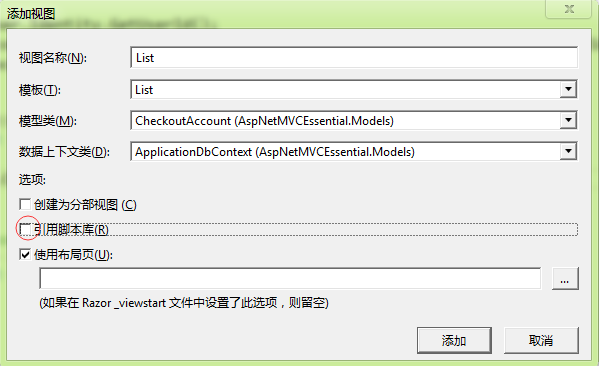

Title: ASP.NET MVC5 学习笔记-4 OWIN和Katana
Date: 2014-10-31 20:48
Category: DotNet
Tags: DotNet, Web, ASP.NET MVC
Author: 刘理想

[TOC]

#ASP.NET MVC5 学习笔记-4 OWIN和Katana

##1. Owin

OWIN全名：Open Web Interface for .NET. 它是一个说明，而非一个框架，该声明用来实现Web服务器和框架的松耦合。它提供了模块化、轻量级和便携的设计。类似Node.js, WSGI.

Katana是微软实现的OWIN组件的集合。包含基础设施组件和功能性组件。并且暴露出了OWIN管道用来添加组件。可以在IIS、OwinHost.exe或者自定义的服务器中托管。

比如OWIN提供了新的登录模式，比如，打开Web.config文件，我们看到：
```
<system.web>
    <authentication mode="None" />
    <compilation debug="true" targetFramework="4.5" />
    <httpRuntime targetFramework="4.5" />
</system.web>
```
我们看到`<authentication mode="None"/>`，这里我们不在使用传统的Form认证，而是使用Owin的认证。我们打开Startup.cs文件，看到如下内容：
```
public partial class Startup
{
    public void Configuration(IAppBuilder app)
    {
        ConfigureAuth(app);
    }
}
```
这里我们使用`ConfigureAuth(app)`来配置认证，打开这个方法的定义，可以看到如下方法：
```
public void ConfigureAuth(IAppBuilder app)
{
    // 使应用程序可以使用 Cookie 来存储已登录用户的信息
    app.UseCookieAuthentication(new CookieAuthenticationOptions
    {
        AuthenticationType = DefaultAuthenticationTypes.ApplicationCookie,
        LoginPath = new PathString("/Account/Login")
    });
    // Use a cookie to temporarily store information about a user logging in with a third party login provider
    app.UseExternalSignInCookie(DefaultAuthenticationTypes.ExternalCookie);

    // 取消注释以下行可允许使用第三方登录提供程序登录
    //app.UseMicrosoftAccountAuthentication(
    //    clientId: "",
    //    clientSecret: "");

    //app.UseTwitterAuthentication(
    //   consumerKey: "",
    //   consumerSecret: "");

    //app.UseFacebookAuthentication(
    //   appId: "",
    //   appSecret: "");

    //app.UseGoogleAuthentication();
}
```

---

##2. 本地认证Local Authentication

默认就是本地认证：
```
// 使应用程序可以使用 Cookie 来存储已登录用户的信息
app.UseCookieAuthentication(new CookieAuthenticationOptions
{
    AuthenticationType = DefaultAuthenticationTypes.ApplicationCookie,
    LoginPath = new PathString("/Account/Login")
});
// Use a cookie to temporarily store information about a user logging in with a third party login provider
app.UseExternalSignInCookie(DefaultAuthenticationTypes.ExternalCookie);
```

##3. 添加Facebook认证

```
// 取消注释以下行可允许使用第三方登录提供程序登录
//app.UseMicrosoftAccountAuthentication(
//    clientId: "",
//    clientSecret: "");

//app.UseTwitterAuthentication(
//   consumerKey: "",
//   consumerSecret: "");

//app.UseFacebookAuthentication(
//   appId: "",
//   appSecret: "");

//app.UseGoogleAuthentication();
```

取消注释对应的行，并且添加appId和appSecret。

第二步，如果在创建账户后需要做一些其他的操作，修改AccountController.cs中的`ExternalLoginConfirmation`方法。

##4. Identity身份

###4.1 使用Claim添加自定义的字段

Identity 是第一个产生出来为每个用户识别身份的。`Account`的`Register`方法先生成创建一个`IdentityResult`，然后再使用`SignInAsync`。

Claim是一个关于用户的声明，由Identity provider提供，比如用户1有Admin角色。

Asp.Net生成的数据库中有`AspNetUsers`，`AspNetUserRoles`和`AspNetUserClaims`表，其中`AspNetUserClaims`用来存储用户自定义的一些信息。
比如给用户在注册时添加一个名称：
```
public async Task<ActionResult> Register(RegisterViewModel model)
{
    if (ModelState.IsValid)
    {
        var user = new ApplicationUser() { UserName = model.Email, Email = model.Email};
        var result = await UserManager.CreateAsync(user, model.Password);
        if (result.Succeeded)
        {
            //添加Claims
            UserManager.AddClaim(user.Id, new Claim(ClaimTypes.GivenName, model.FirstName));
            var service = new CheckingAccountService(HttpContext.GetOwinContext()
                .Get<ApplicationDbContext>());
            service.CreateCheckingAccount(model.FirstName, model.LastName,
                user.Id, 0);
            await SignInAsync(user, isPersistent: false);
            return RedirectToAction("Index", "Home");
        }
        else
        {
            AddErrors(result);
        }
    }

    // 如果我们进行到这一步时某个地方出错，则重新显示表单
    return View(model);
}
```
获取Claims
```
var identity = (ClaimsIdentity) User.Identity;
var name = identity.FindFirstValue(ClaimTypes.GivenName) ?? identity.GetUserName();
```

###4.2 在model中添加自定义的字段

打开`IdentityModels.cs`，在`ApplicationUser`中添加:
```
public class ApplicationUser : IdentityUser
{
    public async Task<ClaimsIdentity> GenerateUserIdentityAsync(UserManager<ApplicationUser> manager)
    {
        var userIdentity = await manager.CreateIdentityAsync(this, DefaultAuthenticationTypes.ApplicationCookie);
        return userIdentity;
    }
    public string Pin { get; set; }
}
```

##5 基于角色的认证

###5.1 为每个用户添加余额显示

每个Controller都有一个User属性，获取当前UserId的方法如下：
```
var userId = User.Identity.GetUserId();
```

比如，我们要获取之前定义的账户余额，可以打开`CheckingAccountController.cs`中添加下面的代码
```
private ApplicationDbContext db = new ApplicationDbContext();

//
// GET: /CheckingAccount/Details/
public ActionResult Details()
{
    var userId = User.Identity.GetUserId();
    var checkingAccount = db.CheckoutAccounts.First(c => c.ApplicationUserId == userId);
    return View(checkingAccount);
}
```
这样每个用户就都能看到自己的账户余额了。

###5.2 显示用户账户余额列表

在`CheckingAccountController.cs`中添加：
```
public ActionResult List()
{
    return View(db.CheckoutAccounts.ToList());
}
```
现在，我们为List添加视图，右键：


**注意**，如果按照上图配置发生错误，并且错误是“运行所选代码生成器时出错”，那么应该将数据上下文类留空，这样就可以了。

然后编辑生成的模板，将编辑改为：
```
@Html.ActionLink("详细", "DetailsForAdmin", new { id=item.Id }) |
```
并且，在`CheckingAccountController.cs`中添加：
```
[Authorize(Roles = "Admin")]
public ActionResult DetailsForAdmin(int id)
{
    var checkingAccount = db.CheckoutAccounts.First(c => c.Id == id);
    return View("Details", checkingAccount);
}
```
请注意，我们添加了`[Authorize(Roles="Admin")]`来限定只有Admin组的才能访问，下一节我们讲介绍如何使用角色分配。

##6 给用户赋值角色

打开`Migrations\Configurations`，在`Seed`方法中添加如下：

```
protected override void Seed(AspNetMVCEssential.Models.ApplicationDbContext context)
{
    //UserStore一定要使用context作为参数
    var userStore = new UserStore<ApplicationUser>(context);
    var userManager = new UserManager<ApplicationUser>(userStore);

    if (!context.Users.Any(u => u.UserName == "liulixiang1988"))
    {
        //1、创建用户
        var user = new ApplicationUser { UserName = "liulixiang1988", Email = "liulixiang1988@gmail.com" };
        //下面这句会创建一个用户并且会立即执行，不需调用SaveChanges
        userManager.Create(user, "passW0rd");

        //2、创建用户相关的账户
        var service = new CheckingAccountService(context);
        service.CreateCheckingAccount("liulixiang1988", "管理员", user.Id, 1000);

        //3、添加角色并保存
        context.Roles.AddOrUpdate(r => r.Name, new IdentityRole { Name = "Admin" });
        context.SaveChanges();

        //4、给用户添加角色，指定Id和角色名
        userManager.AddToRole(user.Id, "Admin");

    }
}
```


