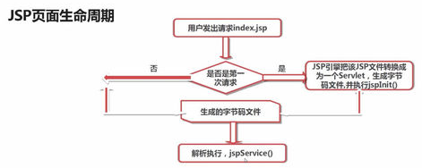

Title: Java Web之JSP-02 JSP基础语法
Date: 2015-04-08 00:30
Category: Java
Tags: Java, Web, JSP
Author: 刘理想

##1. JSP简介

JSP页面元素构成：

1. 静态内容
2. 注释
3. 声明
4. 小脚本
5. 表达式
6. 指令

###1.1 jsp指令

page指令：通常位于jsp页面的顶端，同一个页面可以有多个page指令。
include指令：将一个外部文件嵌入到当前jsp文件中，同时解析这个页面中的jsp语句。
taglib指令：使用标签库定义心得自定义标签。在jsp页面中启用定制行为

page指令语法：

```
<%@page 属性1="value" 属性2="value1, value2" ... %>
```

属性|描述|默认值
--|--|--
language|指定jsp页面使用的脚本语言|java
import|通过该属性来引用脚本语言中使用到的类文件|无
contentType|用来指定jsp页面所采用的编码方式|text/html,ISO-8859-1

###1.2 JSP注释

1. html注释 `<!--html注释-->`
2. jsp注释`<%--注释--%>`
3. jsp脚本注释 `// /**/`

###1.3 jsp脚本

语法：
```
<%
out.println("大家好，欢迎大家学习javaee开发");
%>
```

###1.4 jsp声明

在jsp页面中定义变量或者方法

```
<%!java代码 %>

<%! String s = "lixiang"; 
int add(int x, int y){
    return x+y;
}
```

###1.5 jsp表达式

```
<%=表达式%> //注意：表达式不以分号结束

<%=s%>
<%=add(5+4)%>
```

###1.6 jsp页面生命周期



`jspService()`方法被调用来处理客户端的请求。对每一个请求，JSP引擎创建一个新的线程来处理该请求。如果有多个客户端同时请求该JSP文件，则JSP引擎会创建多个线程。每个客户端请求对应一个线程。以多线程方式执行可以大大降低对系统的资源需求，提高系统的并发量及响应时间。但也要注意多线程的编程带来的同步问题，由于该Servlet始终驻于内存，所以响应时间是非常快的。

###1.7 jsp练习：打印乘法表


