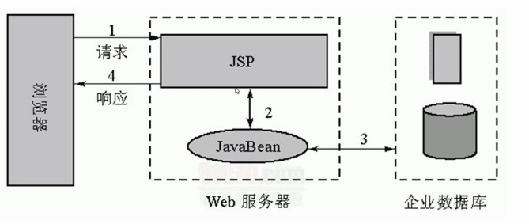

Title: Java Web之JSP-04 Java Beans
Date: 2015-04-09 16:47
Category: Java
Tags: Java, Web, JSP
Author: 刘理想

##1. JavaBean简介
javaBeans就是符合某种特定的规范的java类。使用JavaBeans的好处是解决代码重复编写，减少代码冗余，功能区分明确，提高了代码的可维护性。

JavaBean的设计原则：

1. 公有类
2. 属性私有
3. 无参的公有构造方法
4. getter和setter方法

##2. JSP动作元素

###2.1 什么是JSP动作元素

JSP动作元素（action element），动作元素为请求处理阶段提供信息。动作元素遵循XML语法，有一个包含元素名的开始标签，可以有属性，可选的内容、与开始标签匹配的结束标签。

###2.2 JSP动作元素的五大类
第一类是与存取JavaBean有关的，包括：
`<jsp:useBean> <jsp:setProperty> <jsp:getProperty>`

第二类是JSP1.2就开始有的基本元素，包括6个动作元素：
`<jsp:include> <jsp:forward> <jsp:param> <jsp:plugin> <jsp:params> <jsp:fallback>`

第三类是JSP2.0新增的元素，主要与JSP Document有关，包括6个元素：
`<jsp:root> <jsp:declaration> <jsp:scriptlet> <jsp:expression> <jsp:text> <jsp:output>`

第四类是JSP2.0新增的动作元素，主要是用来动态生成XML元素标签的值，包括三个动作：
`<jsp:attribute> <jsp:body>  <jsp:element>`

第五类是JSP2.0新增的动作元素，主要是用在Tag File中，有2个元素：
`<jsp:invoke> <jsp:dobody>`

##3. 如何在JSP中使用Java  Beans

###3.1 像使用普通java类一样

1. 创建在src文件下，（可以创建包）创建一个类，满足设计原则即可
2. 使用前通过import导入，通过使用new创建Javabean实例.在顶端添加`<%@ page import="com.po.Users" %>`，导入javabean包

###3.2 useBean元素

在JSP页面中通常使用JSP动作标签使用javabean(useBeans动作、setProperty动作、getProperty动作)
`<jsp:useBeans>`
作用：在jsp页面中实例化或者在指定范围内使用javabean:
`<jsp:useBean id="标识符" class="Java类名" scope="作用范围"/>`

###3.3 使用setProperty

`<jsp:setProperty>`动作：给【已经实例化的Javabean对象的属性赋值】，一共有四种形式。

1. 根据表单自动匹配所有的属性
`<jsp:setProperty name="myUsers" property="*"/>`
2. 根据表单自动匹配相应的属性（部分匹配）
`<jsp:setProperty name="myUsers" property="username"/>`
3. 与表单无关，通过手工赋值给属性
`<jsp:setProperty name="myUsers" property="username" value=“Lisa”/>`
4. 通过url传参数给属性赋值
```
<jsp:setProperty name="myUsers" property="username"/>
<jsp:setProperty name="myUsers" property="password" param=“mypass”/>
```

案例：
表单部分：
```
<form action="dologin.jsp" method="post">
  <table>
    <tr>
      <td>用户名</td>
      <td><input type="text" name="username"/></td>
    </tr>
    <tr>
      <td>密码</td>
      <td><input type="password" name="password"/></td>
    </tr>
    <tr>
      <td colspan="2"><input type="submit" value="提交"/></td>
    </tr>
  </table>
</form>
```

dologin.jsp中匹配：
```
<h1>根据表单自动匹配所有属性</h1>
<hr/>
<jsp:useBean id="myUsers" class="liulx.javabean.User" scope="page" />
<%request.setCharacterEncoding("utf-8");%>
<jsp:setProperty name="myUsers" property="*" />
用户名：<%=myUsers.getUsername()%>
密码：<%=myUsers.getPassword()%>
```

###3.4 getProperty标签

`<jsp:getProperty>`动作：获取指定Javabean对象的属性值

`<jsp:getProperty name="JavaBean实例名" property="属性名" />`可以直接得到值

```
用户名：<jsp:getProperty name="myUsers" property="username" />
```

##4. JavaBean四个作用域范围

使用useBeans的scope属性来置顶javabean的作用范围，由小到大排列是：
page->request->session->application

- page对象仅在当前页面有效
- request //可以通过HttpRequest.getAttribute()方法取得JavaBean对象.需要配合请求转发来使用，若使用请求重定向则无法访问到Javabean
- session //可以通过HttpSession.getAttribute()方法取得JavaBean对象则是在一次对话中都会有效
- application//可以通过application.getAttribute()方法取得JavaBean对象。全局，在服务器一次运行期间都有效

request在源页面用request.getRequestDispatcher("/somePage.jsp").forward(request, response); 内部转发的方式将数据传递到下一个页面可获取对象。

##5. Model1简介

Model 1模型出现前，整个Web应用的情况：几乎全部由JSP页面组成，JSP页面接收处理客户端请求，对请求处理后直接做出响应。这样做的弊端：在页面层充斥着大量的业务逻辑代码和数据访问层代码，Web程序的可扩展性和可维护性非常差。

###5.1 javaWeb应用开发，模式分为Model1和Model2
1. Model1早于Model2
2. 在Model1之前，整个Web应用的情况：几乎全部由jsp页组成，jsp处理和响应客户端请求。
· 弊端：【界面层】充斥了大量业务逻辑代码和数据访问层代码，扩展性和维护性非常差

###5.2 Model1
1. Javabean的出现，可以使jsp页面使用Javabean封装的数据和业务逻辑代码，大大提高程序可维护性。
2. Model1 = JSP + JavaBean。如图：JSP访问页面层 -> Javab业务逻辑层 -> 数据库数据访问层



##6. 阶段项目


