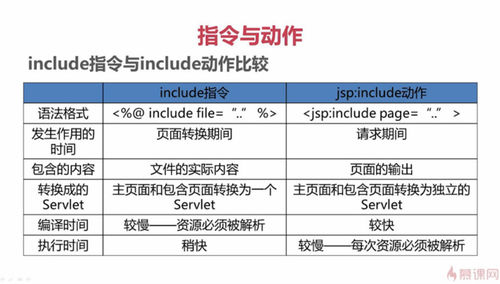

Title: Java Web之JSP-06 JSP指令与动作元素
Date: 2015-04-13 19:37
Category: Java
Tags: Java, Web, JSP
Author: 刘理想

##1. include指令

常用的有page、include、taglib指令这三种指令；
page：位于页面顶端，一个页面可以包含多个page指令
include：将一个外部文件嵌入jsp中，同时解析这个页面中的jsp语句。
taglib：使用标签库，自定义新的标签，在jsp中启动定制行为。

语法 `<% include file="地址"%>`。
案例：显示当前时间的页面。
（1）写一个只输出时间的方法的date.jsp。
（2）用于显示的页面,包含`<% include file="date.jsp"%>`

##2. include动作

1. 是一个动作标签`<jsp:xxx>`
2. 语法：`<jsp:include page="URL" flush="true|false">`
- page属性：要包含的页面
- flush属性：被包含的页面是否从缓冲区里读取

##3. include指令和动作的区别

1. 包含内容： 指令包含的是【源代码】，动作包含的是页面输出的【结果】
2. 生成的servlet：指令会生成一个整体的Servlet；而动作会分别生成两个，即在一个Servlet中调用另一个Servlet
3. 其他区别如图：
4. 使用场合】：页面内容不经常变化使用include指令，页面内容经常变化使用`<jsp:include>`动作



##4. forward指令

forward动作
1、语法：`<jsp:forward page="URL"/>`
2、等于服务器内部转发指令 `request.getRequestDispacher("URL").forward(req,res);`
相当于是服务器内部跳转，URL地址不会发生变化。
四种跳转.
`<% response.sendRedirect("login_seccess.jsp"); %>`//告诉浏览器此路不通,你再问问另一页面能解决你的问题不?
`<jsp:forward page="login_fail.jsp"/>` //服务器将请求转发到另一页面,浏览器不知情.
`<% pageContext.forward("login_fail.jsp");%>` //服务器将请求转发到另一页面,浏览器不知情.
`<% request.getRequestDispatcher("login_fail.jsp").forward(request,response);%>` //服务器将请求转发到另一页面,浏览器不知情.

##5. param动作

1. 语法：`<jsp:param name="参数名" value="参数值">`
2. 【常常与`<jsp:forward></jsp:forward>`一起使用】，并作为其【子标签】。
3. 用于传递新参数或者【修改原有参数值】，修改参数时使用form表单里的参数名称即可。同样用request.getParameter("参数名")获取

必须与forward、include及plugin动作配合使用。通常与forward动作一起使用，作为它的子标签，它的作用是指定某个参数值，可以用于传递参数.

```
<jsp:forward page="url"> 
<jsp:param value="123@qq.com" name="email"/> 
</jsp:forward>
```
