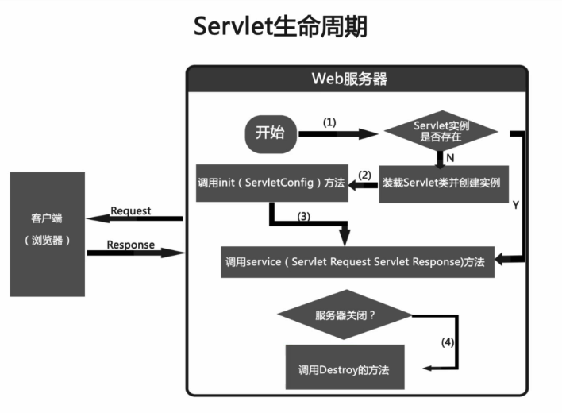
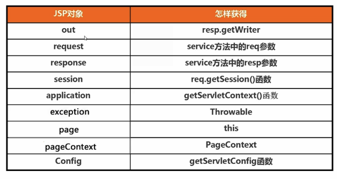

Title: Java Web之Servlet-01 Servlet基础
Date: 2015-04-13 20:31
Category: Java
Tags: Java, Web, Servlet
Author: 刘理想

##1. Servlet概述

jsp前身就是servlet，Servelet是在服务器上运行的小程序。
一个Servlet就是一个Java类，并且可以通过“请求－响应”编程模型来访问的这个驻留在服务器内存里的Servlet程序。

##2. Tomcat容器等级

Tomcat在大多数情况下充当servlet的容器，也就是说：在写完JSP代码后进行第一次执行时，tomcat（servlet容器）先将JSP代码翻译成servlet类（java代码），然后实例化该类，再调用该类的init,service,destory等进行生命周期服务。当客户端再进行第二次访问请求时，此时就没有servlet容器的翻译这一步了，因为之前翻译的java代码会一直保存，以便于后面的访问不再进行翻译，可大大提高访问效率。所以，JSP页面在第一次被访问时，其所花费的时间是最长的。
最主要的方法就是init,service和destroy，它们是servlet对象的生存周期，当一个页面被编译成servlet类，再进行实例化后，这个页面就开始了真正的生命周期，servlet容器会先加载init方法进行初始化，初始化后才可进行接收和相应客户端的消息，之后容器会再加载service，这部分就是真正相应客户端请求的实现逻辑，它实现客户端的请求响应，然后动态生成HTML页面显示到客户端；而destory方法则是在servlet生命周期即将结束时进行的清理工作。


##3. 手工编写第一个Servlet

1. 继承HttpServlet
2. 重写doGet()或者doPost()：右键->source->重写
3. 在web.xml中注册servlet

问题解析：
1、向页面输出html语言 `response.setContentType("text/html;charset=utf-8");`
2、在配置web.xml中

```
<servlet>
    <servlet-name>HelloServlet</servlet-name>
    <servlet-class>servlet.helloServlet</servlet-class>
</servlet>
<servlet-mapping>
    <servlet-name>HelloServlet</servlet-name>
    <url-pattern>/servlet/HelloServlet</url-pattern>//根目录下的路径信息
</servlet-mapping>
```

web.xml中Servlet的配置说明：
1、`<servlet>`标签中
`<servlet-name>`指定servlet名称，`<servlet-class>`指定servlet类，需要使用完整类名
2、`<servlet-mapping>`标签中
`<servlet-name>`指定servlet名称，需要与`<servlet>`标签中的相应servlet名称对应；
`<url-pattern>`指定servlet地址，在Jsp页面中使用的URL需要与相应servlet的地址对应

##4. Servlet生命周期

1. 初始化阶段，调用init()方法。
2. 响应客户端请求，调用service()方法，有service方法根据提交方式，决定使用doGet()还是doPost()方法。
3. 终止阶段，看服务器是否关闭，如果要关闭，那么就要调用destroy()方法。

HttpServlet的两个Service()方法区别
在HttpServlet类中有两个service()方法，如下：
void service(ServletRequest req, ServletResponse res)
protected void service(HttpServletRequest req, HttpServletResponse resp)
其中只有void service(ServletRequest req，ServletResponse response)方法是由tomcat自动调用，它将接收的客户端请求转交给HttpServlet中的另一个protected void service(HttpServletRequest req，HttpServletResponse res)方法，此保护类型的service方法再把将请求分发给doPost()、doGet()方法进行下一步处理。所以我们完全可以重写受保护的service()方法来代替doPost()和doGet()方法。



##5. tomcat装在servlet的三种情况

1. servlet容器启动时自动装在某些servlet，实现它只需要在web.xml文件中的`<servlet></servlet>`之间添加如下代码：`<load-on-startup>1<load-on-startup>`，其中数字越大表示优先级别越高。
2. 在servlet容器启动后，客户首次向servlet发送请求。
3. servlet类被更新后，重新装在servlet。

**注意**，在整个生命周期类，init()方法只被调用一次。如果用粗暴的方法关闭服务器就不会调用destroy()方法。

##6. Servlet与jsp内置对象的关系



out 是jspwriter 对象； resp.getWriter是 PrintWriter对象

##7. Servlet获取表单数据

- 获取一个值的时候用request.getParameter("name名"); 
- 获取一个复选框里面的多个值时用request.getParameterValues("name名");

Servlet跳转类似jsp

对于boolean类型的值，不要使用is，否则java bean中生成的不是get开头的属性。


