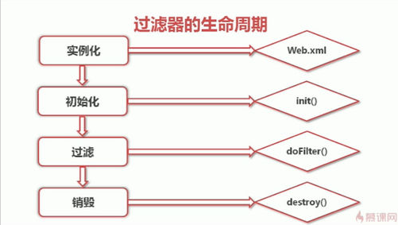
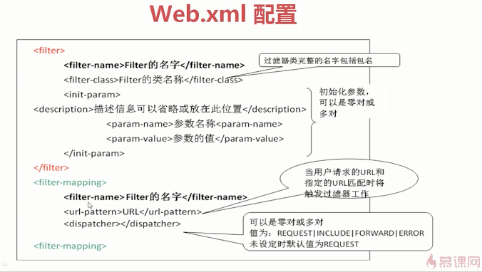
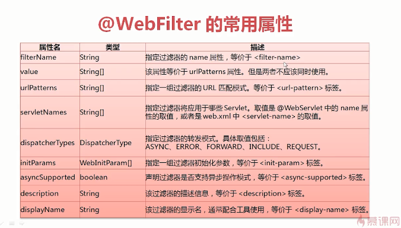

Title: Java Web开发技术应用-过滤器
Date: 2015-04-22 15:45
Category: Java
Tags: Java, Web
Author: 刘理想

##1. Java过滤机制-声明周期



##2. 第一个过滤器

1、创建一个过滤器类 ，继承自servlet下的Filter
2、重写三个方法init() doFilter() destroy()方法
（1）init()初始化：这个方法可以读取web.xml文件中的过滤器初始化参数。通过参数FilterConfig arg0可以获取更多参数
（2）doFIlter()核心：完成实际的过滤操作。当用户请求访问与过滤器【关联的URL】时，Web容器将先调用过滤器的doFilter方法，FilterChain arg2参数可以调用chain.doFilter方法，将请求传给下一个过滤器（或目标资源），或利用转发，重定向将请求转发给其他资源。
(3)web容器在消耗过滤器前调用该方法，用于释放过滤器占用的资源。（大多数情况用不到）

###2.1 定义Filter

```
package liulx.FilterDemo;

import javax.servlet.*;
import java.io.IOException;

public class FirstFilter implements Filter {
    public void destroy() {
        System.out.println("Filter Destroy");
    }

    public void doFilter(ServletRequest req, ServletResponse resp, FilterChain chain) throws ServletException, IOException {
        System.out.println("Do filter before request");
        chain.doFilter(req, resp);
        System.out.println("Do filter after request");
    }

    public void init(FilterConfig config) throws ServletException {
        System.out.println("Init First Filter");
    }
}
```


###2.2 Web.xml配置



过滤器能够改变用户请求的Web资源，也就是能够改变用户请求的路径。
过滤器不能直接返回数据，不能直接处理用户请求。

```
<filter>
    <filter-name>FirstFilter</filter-name>
    <filter-class>liulx.FilterDemo.FirstFilter</filter-class>
</filter>
<filter-mapping>
    <filter-name>FirstFilter</filter-name>
    <url-pattern>/index.jsp</url-pattern>
</filter-mapping>
```

##3. 过滤器链

###3.1 多个过滤器

多个过滤器url-pattern一样时，服务器会按照web.xml中过滤器定义的先后顺序组装成一条链。


##4. 过滤器的分类

Servlet2.5中包含4种过滤器

- REQUEST 用户直接访问时,调用过滤器
- INCLUDE 目标资源通过RequestDispatcher的include访问时，调用过滤器
- FORWARD 目标资源通过RequestDispatcher的forward访问时，调用过滤器
- ERROR 目标资源是通过声明式异常处理机制调用时，调用过滤器

```
    <filter>
        <filter-name>FirstFilter</filter-name>
        <filter-class>liulx.FilterDemo.FirstFilter</filter-class>
    </filter>
    <filter>
        <filter-name>SecondFilter</filter-name>
        <filter-class>liulx.FilterDemo.SecondFilter</filter-class>
    </filter>
    <filter-mapping>
        <filter-name>FirstFilter</filter-name>
        <url-pattern>/index.jsp</url-pattern>
        <dispatcher>REQUEST</dispatcher>
    </filter-mapping>
    <filter-mapping>
        <filter-name>SecondFilter</filter-name>
        <url-pattern>/index.jsp</url-pattern>
    </filter-mapping>
    <error-page>
        <error-code>404</error-code>
        <location>/404.jsp</location>
    </error-page>
    <filter-mapping>
        <filter-name>ErrorFilter</filter-name>
        <url-pattern>/error.jsp</url-pattern>
        <dispatcher>ERROR</dispatcher>
    </filter-mapping>
```

Servlet 3.0 ASYNC标记：异步处理

##5 Servlet 3.0

@WebFilter注解

```
@WebFilter(servletNames={"SimpleServlet"}, filterName="SimpleFilter")
public class LessThanSixFilter implements Filter{
...
}
```





