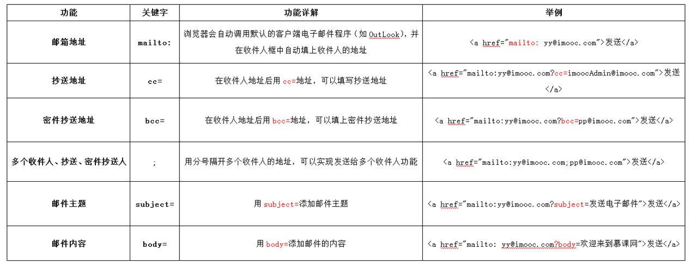
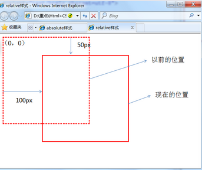
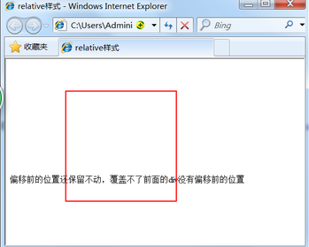
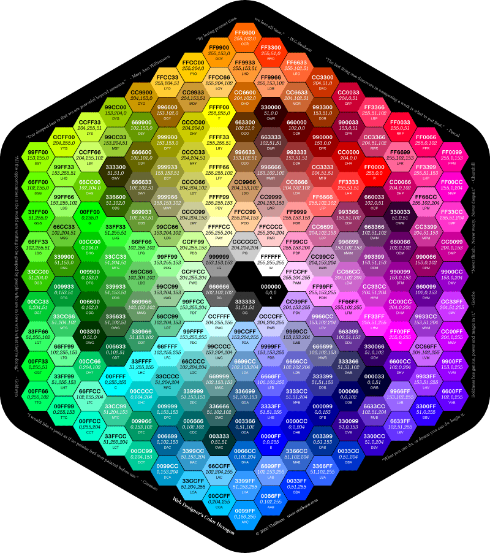

Title: HTML\CSS补遗
Date: 2015-04-06 21:36
Category: Web
Tags: CSS, HTML, LESS
Author: 刘理想

##1. HTML标签

1. `<strong>`和`<em>`：有了段落又有了标题，现在如果想在一段话中特别强调某几个文字，这时候就可以用到`<em>`或`<strong>`标签。但两者在强调的语气上有区别:`<em>` 表示强调，`<strong>` 表示更强烈的强调。并且在浏览器中`<em>` 默认用*斜体*表示，`<strong> `用**粗体**表示。两个标签相比，目前国内前端程序员更喜欢使用`<strong>`表示强调。
2. `<span>`标签是没有语义的，它的作用就是为了设置单独的样式用的。
3. `<q>`标签，短文本引用
4. `<blockquote>`的作用也是引用别人的文本。但它是对长文本的引用，如在文章中引入大段某知名作家的文字，这时需要这个标签。  等等，上一节`<q>`标签不是也是对文本的引用吗？不要忘记`<q>`标签是对简短文本的引用，比如说引用一句话就用到`<q>`标签。
5. `<br>`标签分行显示文本
6. `&nbsp;`空格
7. `<hr>`标签，添加水平横线
8. `<address>`标签，为网页加入地址信息,在浏览器上显示的样式为斜体:`<address>北京市西城区德外大街10号</address>`
9. `<code>`标签:在介绍语言技术的网站中，必免不了在网页中显示一些计算机专业的编程代码，当代码为一行代码时，你就可以使用`<code>`标签了，如下面例子：`<code>var i=i+300;</code>`.注意：在文章中一般如果要插入多行代码时不能使用<code>标签了。如果是多行代码，可以使用`<pre>`标签.
10. `<pre>`标签为你的网页加入大段代码
11. `<ul>`和`<ol>`无序和有序列表
12. table `<table summary=""><caption></caption><tr><th></th></tr><tr><td></td></tr></table>`
13. a:`<a  href="目标网址"  title="鼠标滑过显示的文本">链接显示的文本</a>`.`<a>`标签在默认情况下，链接的网页是在当前浏览器窗口中打开，有时我们需要在新的浏览器窗口中打开，需要：`<a href="目标网址" target="_blank">click here!</a>`, href属性还可以是`mailto:550488300@qq.com`这种形式，其中参数如下图：。
14. img: ``

##2. Form标签

###2.1 文本域，支持多行文本输入
当用户需要在表单中输入大段文字时，需要用到文本输入域。
语法：
`<textarea  rows="行数" cols="列数">文本</textarea>`
1、`<textarea>`标签是成对出现的，以`<textarea>`开始，以`</textarea>`结束。
2、cols ：多行输入域的列数。
3、rows ：多行输入域的行数。
4、在`<textarea></textarea>`标签之间可以输入默认值。

###2.2 使用单选框、复选框，让用户选择

在使用表单设计调查表时，为了减少用户的操作，使用选择框是一个好主意，html中有两种选择框，即单选框和复选框，两者的区别是单选框中的选项用户只能选择一项，而复选框中用户可以任意选择多项，甚至全选。请看下面的例子:
语法：
`<input   type="radio/checkbox"   value="值"    name="名称"   checked="checked"/>`
1、type:
   当 type="radio" 时，控件为单选框
   当 type="checkbox" 时，控件为复选框
2、value：提交数据到服务器的值（后台程序PHP使用）
3、name：为控件命名，以备后台程序 ASP、PHP 使用
4、checked：当设置 checked="checked" 时，该选项被默认选中

**注意**:同一组的单选按钮，name 取值一定要一致，比如上面例子为同一个名称“radioLove”，这样同一组的单选按钮才可以起到单选的作用。

###2.3 select

单选：

```
<select>
  <option value="看书">看书</option>
  <option value="旅游" selected="selected">旅游</option>
  <option value="运动">运动</option>
  <option value="购物">购物</option>
</select>
```

使用下拉列表框进行多选
下拉列表也可以进行多选操作，在`<select>`标签中设置`multiple="multiple"`属性，就可以实现多选功能，在 widows 操作系统下，进行多选时按下Ctrl键同时进行单击（在 Mac下使用 Command +单击），可以选择多个选项。如下代码：
```
<select multiple="multiple">
  <option value="看书">看书</option>
  <option value="旅游">旅游</option>
  <option value="运动">运动</option>
  <option value="购物">购物</option>
</select>
```

###2.4 使用提交按钮，提交数据

在表单中有两种按钮可以使用，分别为：提交按钮、重置。这一小节讲解提交按钮：当用户需要提交表单信息到服务器时，需要用到提交按钮。
语法：
`<input   type="submit"   value="提交">`
type：只有当`type`值设置为`submit`时，按钮才有提交作用
value：按钮上显示的文字

###2.5 使用重置按钮，重置表单信息

当用户需要重置表单信息到初始时的状态时，比如用户输入“用户名”后，发现书写有误，可以使用重置按钮使输入框恢复到初始状态。只需要把type设置为"reset"就可以。
语法：
`<input type="reset" value="重置">`
type：只有当type值设置为reset时，按钮才有重置作用
value：按钮上显示的文字

```
<form action="save.php" method="post" >
    <label>爱好:</label>
    <select>
      <option value="看书">看书</option>
      <option value="旅游" selected="selected">旅游</option>
      <option value="运动">运动</option>
      <option value="购物">购物</option>
    </select>
    <input type="submit" value="确定"  />
    <input type="reset" value="重置"  />
</form>
```

###2.6 form表单中的label标签
小伙伴们，你们在前面学习表单各种控件的时候，有没有发现一个标签--label，这一小节就来揭晓它的作用。
label标签不会向用户呈现任何特殊效果，它的作用是为鼠标用户改进了可用性。如果你在 label 标签内点击文本，就会触发此控件。就是说，当用户单击选中该label标签时，浏览器就会自动将焦点转到和标签相关的表单控件上（就自动选中和该label标签相关连的表单控件上）。
语法：
`<label for="控件id名称">`
注意：标签的 for 属性中的值应当与相关控件的 id 属性值一定要相同。
例子：
```
<form>
  <label for="male">男</label>
  <input type="radio" name="sex" id="male" />
  <br />
  <label for="female">女</label>
  <input type="radio" name="sex" id="female" />
  <label for="email">输入你的邮箱地址</label>
  <input type="email" id="email" placeholder="Enter email">
</form>
```

##3. CSS基础

优先级：内联式 > 嵌入式 > 外部式

###3.1 子选择器
还有一个比较有用的选择器子选择器，即大于符号(>),用于选择指定标签元素的第一代子元素。`.food>li{border:1px solid red;}`

###3.2 包含(后代)选择器
包含选择器，即加入空格,用于选择指定标签元素下的后辈元素。`.first  span{color:red;}`

###3.3 通用选择器
通用选择器是功能最强大的选择器，它使用一个（*）号指定，它的作用是匹配html中所有标签元素，如下使用下面代码使用html中任意标签元素字体颜色全部设置为红色：`* {color:red;}`

###3.4 伪类选择符
更有趣的是伪类选择符，为什么叫做伪类选择符，它允许给html不存在的标签（标签的某种状态）设置样式，比如说我们给html中一个标签元素的鼠标滑过的状态来设置字体颜色：
`a:hover{color:red;}`
上面一行代码就是为 a 标签鼠标滑过的状态设置字体颜色变红。这样就会使第一段文字内容中的“胆小如鼠”文字加入鼠标滑过字体颜色变为红色特效。
关于伪选择符：
关于伪类选择符，到目前为止，可以兼容所有浏鉴器的“伪类选择符”就是 a 标签上使用 :hover 了（其实伪类选择符还有很多，尤其是 css3 中，但是因为不能兼容所有浏鉴器，本教程只是讲了这一种最常用的）。其实 :hover 可以放在任意的标签上，比如说 p:hover，但是它们的兼容性也是很不好的，所以现在比较常用的还是 a:hover 的组合。

###3.5 分组选择符
当你想为html中多个标签元素设置同一个样式时，可以使用分组选择符（，），如下代码为右侧代码编辑器中的h1、span标签同时设置字体颜色为红色：
`h1,span{color:red;}`
它相当于下面两行代码：
```
h1{color:red;}
span{color:red;}
```

###3.6 CSS的继承、层叠和特殊性

####3.6.1 继承
CSS的某些样式是具有继承性的，那么什么是继承呢？继承是一种规则，它允许样式不仅应用于某个特定html标签元素，而且应用于其后代。比如下面代码：如某种颜色应用于p标签，这个颜色设置不仅应用p标签，还应用于p标签中的所有子元素文本，这里子元素为span标签。
`p{color:red;}`

`<p>三年级时，我还是一个<span>胆小如鼠</span>的小女孩。</p>`
可见右侧结果窗口中p中的文本与span中的文本都设置为了红色。但注意有一些css样式是不具有继承性的。如`border:1px solid red;`
`p{border:1px solid red;}`

`<p>三年级时，我还是一个<span>胆小如鼠</span>的小女孩。</p>`
在上面例子中它代码的作用只是给p标签设置了边框为1像素、红色、实心边框线，而对于子元素span是没用起到作用的。

####3.6.2 特殊性
有的时候我们为同一个元素设置了不同的CSS样式代码，那么元素会启用哪一个CSS样式呢?我们来看一下面的代码：
```
p{color:red;}
.first{color:green;}
```
`<p class="first">三年级时，我还是一个<span>胆小如鼠</span>的小女孩。</p>`
p和.first都匹配到了p这个标签上，那么会显示哪种颜色呢？green是正确的颜色，那么为什么呢？是因为浏览器是根据权值来判断使用哪种css样式的，权值高的就使用哪种css样式。
下面是权值的规则：
标签的权值为1，类选择符的权值为10，ID选择符的权值最高为100。例如下面的代码：
```
p{color:red;} /*权值为1*/
p span{color:green;} /*权值为1+1=2*/
.warning{color:white;} /*权值为10*/
p span.warning{color:purple;} /*权值为1+1+10=12*/
#footer .note p{color:yellow;} /*权值为100+10+1=111*/
```
注意：还有一个权值比较特殊--继承也有权值但很低，有的文献提出它只有0.1，所以可以理解为继承的权值最低。

####3.6.3 层叠
我们来思考一个问题：如果在html文件中对于同一个元素可以有多个css样式存在并且这多个css样式具有相同权重值怎么办？好，这一小节中的层叠帮你解决这个问题。
层叠就是在html文件中对于同一个元素可以有多个css样式存在，当有相同权重的样式存在时，会根据这些css样式的前后顺序来决定，处于最后面的css样式会被应用。
如下面代码:
```
p{color:red;}
p{color:green;}
<p class="first">三年级时，我还是一个<span>胆小如鼠</span>的小女孩。</p>
```
最后 p 中的文本会设置为green，这个层叠很好理解，理解为后面的样式会覆盖前面的样式。
所以前面的css样式优先级就不难理解了：
内联样式表（标签内部）> 嵌入样式表（当前文件中）> 外部样式表（外部文件中）。

####3.6.4 重要性
我们在做网页代码的时，有些特殊的情况需要为某些样式设置具有最高权值，怎么办？这时候我们可以使用`!important`来解决。
如下代码：
```
p{color:red!important;}
p{color:green;}
<p class="first">三年级时，我还是一个<span>胆小如鼠</span>的小女孩。</p>
```
这时 p 段落中的文本会显示的red红色。
**注意：`!important`要写在分号的前面**
这里注意当网页制作者不设置css样式时，浏览器会按照自己的一套样式来显示网页。并且用户也可以在浏览器中设置自己习惯的样式，比如有的用户习惯把字号设置为大一些，使其查看网页的文本更加清楚。这时注意样式优先级为：浏览器默认的样式 < 网页制作者样式 < 用户自己设置的样式，但记住`!important`优先级样式是个例外，权值高于用户自己设置的样式。

###3.7 CSS格式化排版

####3.7.1 文字排版--字体
我们可以使用css样式为网页中的文字设置字体、字号、颜色等样式属性。下面我们来看一个例子，下面代码实现：为网页中的文字设置字体为宋体。
`body{font-family:"宋体";}`
这里注意不要设置不常用的字体，因为如果用户本地电脑上如果没有安装你设置的字体，就会显示浏览器默认的字体。（因为用户是否可以看到你设置的字体样式取决于用户本地电脑上是否安装你设置的字体。）
现在一般网页喜欢设置“微软雅黑”，如下代码：
`body{font-family:"Microsoft Yahei";}`
或
`body{font-family:"微软雅黑";}`
注意：第一种方法比第二种方法兼容性更好一些。
因为这种字体即美观又可以在客户端安全的显示出来（用户本地一般都是默认安装的）。

####3.7.2 文字排版--字号、颜色
可以使用下面代码设置网页中文字的字号为12像素，并把字体颜色设置为#666(灰色)：
`body{font-size:12px;color:#666}`

####3.7.3 文字排版--粗体
我们还可以使用css样式来改变文字的样式：粗体、斜体、下划线、删除线，可以使用下面代码实现设置文字以粗体样式显示出来。
`p span{font-weight:bold;}`
在这里大家可以看到，如果想为文字设置粗体是有单独的css样式来实现的，再不用为了实现粗体样式而使用h1-h6或strong标签了。

####3.7.4 文字排版--斜体
以下代码可以实现文字以斜体样式在浏览器中显示：
`p a{font-style:italic;}`

`<p>三年级时，我还是一个<a>胆小如鼠</a>的小女孩。</p>`

####3.7.5 文字排版--下划线
有些情况下想为文字设置为下划线样式，这样可以在视觉上强调文字，可以使用下面代码来实现：
```
p a{text-decoration:underline;}
<p>三年级时，我还是一个<a>胆小如鼠</a>的小女孩。</p>
```

####3.7.6 文字排版--删除线
如果想在网页上设置删除线怎么办, 使用下面代码就可以实现：
`.oldPrice{text-decoration:line-through;}`

####3.7.7 段落排版--缩进
中文文字中的段前习惯空两个文字的空白，这个特殊的样式可以用下面代码来实现：
```
p{text-indent:2em;}
<p>1922年的春天，一个想要成名名叫尼克卡拉威（托比?马奎尔Tobey Maguire 饰）的作家，离开了美国中西部，来到了纽约。那是一个道德感渐失，爵士乐流行，走私为王，股票飞涨的时代。为了追寻他的美国梦，他搬入纽约附近一海湾居住。</p>
```

注意：2em的意思就是文字的2倍大小。

####3.7.8 段落排版--行间距（行高）
这一小节我们来学习一下另一个在段落排版中起重要作用的行间距（行高）属性（line-height），如下代码实现设置段落行间距为1.5倍。
```
p{line-height:1.5em;}
<p>菲茨杰拉德，二十世纪美国文学巨擘之一，兼具作家和编剧双重身份。他以诗人的敏感和戏剧家的想象为"爵士乐时代"吟唱华丽挽歌，其诗人和梦想家的气质亦为那个奢靡年代的不二注解。</p>
```

####3.7.9 段落排版--字间距、字母间距
文字间隔、字母间隔设置：
如果想在网页排版中设置文字间隔或者字母间隔就可以使用    letter-spacing来实现，如下面代码：
```
h1{
    letter-spacing:50px;
}

<h1>了不起的盖茨比</h1>
```
注意：这个样式使用在英文单词时，是设置字母与字母之间的间距。
单词间距设置：
如果我想设置英文单词之间的间距呢？可以使用word-spacing来实现。如下代码：
```
h1{
    word-spacing:50px;
}
<h1>welcome to imooc!</h1>
```

####3.7.10 段落排版--对齐
想为块状元素中的文本、图片设置居中样式吗？可以使用text-align样式代码，如下代码可实现文本居中显示。(那么什么是块状元素呢？在后面的11-1、11-2小节中会讲到。)
```
h1{
    text-align:center;
}

<h1>了不起的盖茨比</h1>
```

同样可以设置居左：
```
h1{
    text-align:left;
}

<h1>了不起的盖茨比</h1>
```
还可以设置居右：
```
h1{
    text-align:right;
}
<h1>了不起的盖茨比</h1>
```

###3.8 CSS盒子模型

####3.8.1 元素分类
在讲解CSS布局之前，我们需要提前知道一些知识，在CSS中，html中的标签元素大体被分为三种不同的类型：块状元素、内联元素(又叫行内元素)和内联块状元素。
常用的块状元素有：
```
<div>、<p>、<h1>...<h6>、<ol>、<ul>、<dl>、<table>、<address>、<blockquote> 、<form>
```

常用的内联元素有：
```
<a>、<span>、<br>、<i>、<em>、<strong>、<label>、<q>、<var>、<cite>、<code>
```
常用的内联块状元素有：
```
、<input>
```

####3.8.2 元素分类--块级元素
什么是块级元素？在html中`<div>、 <p>、<h1>、<form>、<ul>` 和 `<li>`就是块级元素。设置`display:block`就是将元素显示为块级元素。如下代码就是将内联元素a转换为块状元素，从而使a元素具有块状元素特点。
`a{display:block;}`
块级元素特点：
1、每个块级元素都从新的一行开始，并且其后的元素也另起一行。（真霸道，一个块级元素独占一行）
2、元素的高度、宽度、行高以及顶和底边距都可设置。
3、元素宽度在不设置的情况下，是它本身父容器的100%（和父元素的宽度一致），除非设定一个宽度。

####3.8.3 元素分类--内联元素
在html中，`<span>、<a>、<label>、<input>、 、 <strong> 和<em>`就是典型的内联元素（行内元素）（inline）元素。当然块状元素也可以通过代码`display:inline`将元素设置为内联元素。如下代码就是将块状元素div转换为内联元素，从页使用div元素具有内联元素特点。
内联元素特点：
1、和其他元素都在一行上；
2、元素的高度、宽度、行高及顶部和底部边距不可设置；
3、元素的宽度就是它包含的文字或图片的宽度，不可改变。
小伙伴们你们观查一下右侧代码段，有没有发现一个问题，内联元素之间有一个间距问题，这个问题在本小节的wiki中有介绍，感兴趣的小伙伴可以去查看。

####3.8.4 元素分类--内联块状元素
内联块状元素（inline-block）就是同时具备内联元素、块状元素的特点，代码`display:inline-block`就是将元素设置为内联块状元素。(css2.1新增)，`、<input>`标签就是这种内联块状标签。
`inline-block`元素特点：
1、和其他元素都在一行上；
2、元素的高度、宽度、行高以及顶和底边距都可设置。
提示：下一小节是用视频动画来讲解css中的盒模型。

####3.8.5 盒模型--边框
盒子模型的边框就是围绕着内容及补白的线，这条线你可以设置它的粗细、样式和颜色(边框三个属性)。
如下面代码为 div 来设置边框粗细为 2px、样式为实心的、颜色为红色的边框：
```
div{
    border:2px  solid  red;
}
```
上面是 border 代码的缩写形式，可以分开写：
```
div{
    border-width:2px;
    border-style:solid;
    border-color:red;
}
```
注意：
1、border-style（边框样式）常见样式有：
`dashed（虚线）| dotted（点线）| solid（实线）`。

2、border-color（边框颜色）中的颜色可设置为十六进制颜色，如:
`border-color:#888;//前面的井号不要忘掉。`

3、border-width（边框宽度）中的宽度也可以设置为：
`thin | medium | thick（但不是很常用），最常还是用象素（px）。`

现在有一个问题，如果有想为 p 标签单独设置下边框，而其它三边都不设置边框样式怎么办呢？css 样式中允许只为一个方向的边框设置样式：
`div{border-bottom:1px solid red;}`
同样可以使用下面代码实现其它三边(上、右、左)边框的设置：
```
border-top:1px solid red;
border-right:1px solid red; 
border-left:1px solid red;
```

####3.8.6 盒模型--宽度和高度
盒模型宽度和高度和我们平常所说的物体的宽度和高度理解是不一样的，css内定义的宽（width）和高（height），指的是填充以里的内容范围。
因此一个元素实际宽度（盒子的宽度）=左边界+左边框+左填充+内容宽度+右填充+右边框+右边界。

```
div{
    width:200px;
    padding:20px;
    border:1px solid red;
    margin:10px;    
}
```

####3.8.7 盒模型--填充
元素内容与边框之间是可以设置距离的，称之为“填充”。填充也可分为上、右、下、左(顺时针)。如下代码：
`div{padding:20px 10px 15px 30px;}`
顺序一定不要搞混。可以分开写上面代码：
```
div{
   padding-top:20px;
   padding-right:10px;
   padding-bottom:15px;
   padding-left:30px;
}
```
如果上、右、下、左的填充都为10px;可以这么写
```
div{padding:10px;}
```
如果上下填充一样为10px，左右一样为20px，可以这么写：
```
div{padding:10px 20px;}
```

####3.8.8 盒模型--边界
元素与其它元素之间的距离可以使用边界（margin）来设置。边界也是可分为上、右、下、左。如下代码：
`div{margin:20px 10px 15px 30px;}`
也可以分开写：
```
div{
   margin-top:20px;
   margin-right:10px;
   margin-bottom:15px;
   margin-left:30px;
}
```
如果上右下左的边界都为10px;可以这么写：
`div{ margin:10px;}`
如果上下边界一样为10px，左右一样为20px，可以这么写：
`div{ margin:10px 20px;}`
总结一下：padding和margin的区别，padding在边框里，margin在边框外。

###3.9 CSS布局模型

####3.9.1 css布局模型
清楚了CSS 盒模型的基本概念、 盒模型类型， 我们就可以深入探讨网页布局的基本模型了。布局模型与盒模型一样都是 CSS 最基本、 最核心的概念。 但布局模型是建立在盒模型基础之上，又不同于我们常说的 CSS 布局样式或 CSS 布局模板。如果说布局模型是本，那么 CSS 布局模板就是末了，是外在的表现形式。 
CSS包含3种基本的布局模型，用英文概括为：Flow、Layer 和 Float。
在网页中，元素有三种布局模型：
1、流动模型（Flow）
2、浮动模型 (Float)
3、层模型（Layer）
这三个布局模型究竟是什么布局？下面几个小节会详细给大家介绍。

####3.9.2 流动模型
先来说一说流动模型，流动（Flow）是默认的网页布局模式。也就是说网页在默认状态下的 HTML 网页元素都是根据流动模型来分布网页内容的。
流动布局模型具有2个比较典型的特征：

1. 块状元素都会在所处的包含元素内自上而下按顺序垂直延伸分布，因为在默认状态下，块状元素的宽度都为100%。实际上，块状元素都会以行的形式占据位置。
2. 在流动模型下，内联元素都会在所处的包含元素内从左到右水平分布显示。（内联元素可不像块状元素这么霸道独占一行）

####3.9.3 浮动模型
块状元素这么霸道都是独占一行，如果现在我们想让两个块状元素并排显示，怎么办呢？不要着急，设置元素浮动就可以实现这一愿望。
任何元素在默认情况下是不能浮动的，但可以用 CSS 定义为浮动，如 div、p、table、img 等元素都可以被定义为浮动。如下代码可以实现两个 div 元素一行显示。
```
div{
    width:200px;
    height:200px;
    border:2px red solid;
    float:left;
}
<div id="div1"></div>
<div id="div2"></div>
```

####3.9.4 什么是层模型？
什么是层布局模型？层布局模型就像是图像软件PhotoShop中非常流行的图层编辑功能一样，每个图层能够精确定位操作，但在网页设计领域，由于网页大小的活动性，层布局没能受到热捧。但是在网页上局部使用层布局还是有其方便之处的。下面我们来学习一下html中的层布局。
如何让html元素在网页中精确定位，就像图像软件PhotoShop中的图层一样可以对每个图层能够精确定位操作。CSS定义了一组定位（positioning）属性来支持层布局模型。
层模型有三种形式：
1. 绝对定位(position: absolute)
2. 相对定位(position: relative)
3. 固定定位(position: fixed)

####3.9.5 层模型--绝对定位
如果想为元素设置层模型中的绝对定位，需要设置position:absolute(表示绝对定位)，这条语句的作用将元素从文档流中拖出来，然后使用left、right、top、bottom属性相对于其最接近的一个具有定位属性的父包含块进行绝对定位。如果不存在这样的包含块，则相对于body元素，即相对于浏览器窗口。
如下面代码可以实现div元素相对于浏览器窗口向右移动100px，向下移动50px。
```
div{
    width:200px;
    height:200px;
    border:2px red solid;
    position:absolute;
    left:100px;
    top:50px;
}
<div id="div1"></div>
```

####3.9.6 层模型--相对定位
如果想为元素设置层模型中的相对定位，需要设置position:relative（表示相对定位），它通过left、right、top、bottom属性确定元素在正常文档流中的偏移位置。相对定位完成的过程是首先按static(float)方式生成一个元素(并且元素像层一样浮动了起来)，然后相对于以前的位置移动，移动的方向和幅度由left、right、top、bottom属性确定，偏移前的位置保留不动。
如下代码实现相对于以前位置向下移动50px，向右移动100px;
```
#div1{
    width:200px;
    height:200px;
    border:2px red solid;
    position:relative;
    left:100px;
    top:50px;
}

<div id="div1"></div>
```



什么叫做“偏移前的位置保留不动”呢？
大家可以做一个实验，在右侧代码编辑器的19行div标签的后面加入一个span标签，在标并在span标签中写入一些文字。如下代码：
```
<body>
    <div id="div1"></div><span>偏移前的位置还保留不动，覆盖不了前面的div没有偏移前的位置</span>
</body>
```

从效果图中可以明显的看出，虽然div元素相对于以前的位置产生了偏移，但是div元素以前的位置还是保留着，所以后面的span元素是显示在了div元素以前位置的后面。

####3.9.7 层模型--固定定位
fixed：表示固定定位，与absolute定位类型类似，但它的相对移动的坐标是视图（屏幕内的网页窗口）本身。由于视图本身是固定的，它不会随浏览器窗口的滚动条滚动而变化，除非你在屏幕中移动浏览器窗口的屏幕位置，或改变浏览器窗口的显示大小，因此固定定位的元素会始终位于浏览器窗口内视图的某个位置，不会受文档流动影响，这与background-attachment:fixed;属性功能相同。以下代码可以实现相对于浏览器视图向右移动100px，向下移动50px。并且拖动滚动条时位置固定不变。
```
#div1{
    width:200px;
    height:200px;
    border:2px red solid;
    position:fixed;
    left:100px;
    top:50px;
}
<p>文本文本文本文本文本文本文本文本文本文本文本文本文本文本文本文本文本文本文本文本文本文本文本文本文本文本文本文本文本文本文本文本文本文本。</p>
....
```

####3.9.8 Relative与Absolute组合使用
小伙伴们学习了绝对定位的方法：使用position:absolute可以实现被设置元素相对于浏览器（body）设置定位以后，大家有没有想过可不可以相对于其它元素进行定位呢？答案是肯定的，当然可以。使用position:relative来帮忙，但是必须遵守下面规范：
1、参照定位的元素必须是相对定位元素的前辈元素：
```
<div id="box1"><!--参照定位的元素-->
    <div id="box2">相对参照元素进行定位</div><!--相对定位元素-->
</div>
```
从上面代码可以看出box1是box2的父元素（父元素当然也是前辈元素了）。
2、参照定位的元素必须加入position:relative;
```
#box1{
    width:200px;
    height:200px;
    position:relative;        
}
```
3、定位元素加入position:absolute，便可以使用top、bottom、left、right来进行偏移定位了。
```
#box2{
    position:absolute;
    top:20px;
    left:30px;         
}
```
这样box2就可以相对于父元素box1定位了（这里注意参照物就可以不是浏览器了，而可以自由设置了）。

###3.10 CSS代码缩写，占用更少的带宽

####3.10.1 盒模型代码简写
还记得在讲盒模型时外边距(margin)、内边距(padding)和边框(border)设置上下左右四个方向的边距是按照顺时针方向设置的：上右下左。具体应用在margin和padding的例子如下：
`margin:10px 15px 12px 14px;/*上设置为10px、右设置为15px、下设置为12px、左设置为14px*/`
通常有下面三种缩写方法:
1、如果top、right、bottom、left的值相同，如下面代码：
`margin:10px 10px 10px 10px;`
可缩写为：
`margin:10px;`
2、如果top和bottom值相同、left和 right的值相同，如下面代码：
`margin:10px 20px 10px 20px;`
可缩写为：
`margin:10px 20px;`
3、如果left和right的值相同，如下面代码：
`margin:10px 20px 30px 20px;`
可缩写为：
`margin:10px 20px 30px;`
注意：padding、border的缩写方法和margin是一致的。

####3.10.2 颜色值缩写
关于颜色的css样式也是可以缩写的，当你设置的颜色是16进制的色彩值时，如果每两位的值相同，可以缩写一半。
例子1：
`p{color:#000000;}`
可以缩写为：
`p{color: #000;}`
例子2：
`p{color: #336699;}`
可以缩写为：
`p{color: #369;}`

####3.10.3 字体缩写
网页中的字体css样式代码也有他自己的缩写方式，下面是给网页设置字体的代码：
```
body{
    font-style:italic;
    font-variant:small-caps; 
    font-weight:bold; 
    font-size:12px; 
    line-height:1.5em; 
    font-family:"宋体",sans-serif;
}
```
这么多行的代码其实可以缩写为一句：
```
body{
    font:italic  small-caps  bold  12px/1.5em  "宋体",sans-serif;
}
```
注意：
1、使用这一简写方式你至少要指定 font-size 和 font-family 属性，其他的属性(如 font-weight、font-style、font-varient、line-height)如未指定将自动使用默认值。
2、在缩写时 font-size 与 line-height 中间要加入“/”斜扛。
一般情况下因为对于中文网站，英文还是比较少的，所以下面缩写代码比较常用：
```
body{
    font:12px/1.5em  "宋体",sans-serif;
}
```
只是有字号、行间距、中文字体、英文字体设置。

###3.11 单位和值

####3.11.1 颜色值
在网页中的颜色设置是非常重要，有字体颜色（color）、背景颜色（background-color）、边框颜色（border）等，设置颜色的方法也有很多种：
1、英文命令颜色
前面几个小节中经常用到的就是这种设置方法：
`p{color:red;}`
2、RGB颜色
这个与 photoshop 中的 RGB 颜色是一致的，由 R(red)、G(green)、B(blue) 三种颜色的比例来配色。
`p{color:rgb(133,45,200);}`
每一项的值可以是 0~255 之间的整数，也可以是 0%~100% 的百分数。如：
`p{color:rgb(20%,33%,25%);}`
3、十六进制颜色
这种颜色设置方法是现在比较普遍使用的方法，其原理其实也是 RGB 设置，但是其每一项的值由 0-255 变成了十六进制 00-ff。
`p{color:#00ffff;}`
配色表：


####3.11.2 长度值
长度单位总结一下，目前比较常用到px（像素）、em、% 百分比，要注意其实这三种单位都是相对单位。
1、像素
像素为什么是相对单位呢？因为像素指的是显示器上的小点（CSS规范中假设“90像素=1英寸”）。实际情况是浏览器会使用显示器的实际像素值有关，在目前大多数的设计者都倾向于使用像素（px）作为单位。
2、em
就是本元素给定字体的 font-size 值，如果元素的 font-size 为 14px ，那么 1em = 14px；如果 font-size 为 18px，那么 1em = 18px。如下代码：
`p{font-size:12px;text-indent:2em;}`
上面代码就是可以实现段落首行缩进 24px（也就是两个字体大小的距离）。
下面注意一个特殊情况：
但当给 font-size 设置单位为 em 时，此时计算的标准以 p 的父元素的 font-size 为基础。如下代码：
html:
`<p>以这个<span>例子</span>为例。</p>`
css:
```
p{font-size:14px}
span{font-size:0.8em;}
```
结果 span 中的字体“例子”字体大小就为 11.2px（14 * 0.8 = 11.2px）。
3、百分比
`p{font-size:12px;line-height:130%}`
设置行高（行间距）为字体的130%（12 * 1.3 = 15.6px）。

### 3.12 css样式设置小技巧

####3.12.1 水平居中设置-行内元素
我们在实际工作中常会遇到需要设置水平居中场景，今天我们就来看看怎么设置水平居中的。
如果被设置元素为文本、图片等行内元素时，水平居中是通过给父元素设置 text-align:center 来实现的。如下代码：
html代码：
```
<body>
  <div class="txtCenter">我是文本，哈哈，我想要在父容器中水平居中显示。</div>
</body>
css代码：
<style>
  div.txtCenter{
    text-align:center;
  }
</style>
```

####3.12.2 水平居中设置-定宽块状元素
当被设置元素为块状元素时用 text-align：center 就不起作用了，这时也分两种情况：定宽块状元素和不定宽块状元素。这一小节我们先来讲一讲定宽块状元素。
满足定宽和块状两个条件的元素是可以通过设置“左右margin”值为“auto”来实现居中的。我们来看个例子就是设置 div 这个块状元素水平居中：
html代码：
```
<body>
  <div>我是定宽块状元素，哈哈，我要水平居中显示。</div>
</body>
```

css代码：
```
<style>
div{
    border:1px solid red;/*为了显示居中效果明显为 div 设置了边框*/
    
    width:500px;/*定宽*/
    margin:20px auto;/* margin-left 与 margin-right 设置为 auto */
}
</style>
```

也可以写成：
```
margin-left:auto;
margin-right:auto;
```

注意：元素的“上下 margin” 是可以随意设置的。

####3.12.3 水平居中总结-不定宽块状元素方法（一）
在实际工作中我们会遇到需要为“不定宽度的块状元素”设置居中，比如网页上的分页导航，因为分页的数量是不确定的，所以我们不能通过设置宽度来限制它的弹性。
不定宽度的块状元素有三种方法居中（这三种方法目前使用的都比多）：
1. 加入 table 标签
2. 设置 display:inline 方法
3. 设置 position:relative 和 left:50%;

这一小节我们来讲一下第一种方法：
第一步：为需要设置的居中的元素外面加入一个 table 标签 ( 包括 <tbody>、<tr>、<td> )。
第二步：为这个 table 设置“左右 margin 居中”（这个和定宽块状元素的方法一样）。
举例如下：
html代码：
```
<div>
<table>
  <tbody>
    <tr><td>
    <ul>
        <li><a href="#">1</a></li>
        <li><a href="#">2</a></li>
        <li><a href="#">3</a></li>
    </ul>
    </td></tr>
  </tbody>
</table>
</div>
```

css代码：
```
<style>
table{
    margin:0 auto;
}

ul{list-style:none;margin:0;padding:0;}
li{float:left;display:inline;margin-right:8px;}
</style>
 ```

 ####3.12.4 水平居中总结-不定宽块状元素方法（二）
第二种方法：改变块级元素的 dispaly 为 inline 类型，然后使用 text-align:center 来实现居中效果。如下例子：
html代码：
```
<body>
<div class="container">
    <ul>
        <li><a href="#">1</a></li>
        <li><a href="#">2</a></li>
        <li><a href="#">3</a></li>
    </ul>
</div>
</body>
```

css代码：
```
<style>
.container{
    text-align:center;
}
.container ul{
    list-style:none;
    margin:0;
    padding:0;
    display:inline;
}
.container li{
    margin-right:8px;
    display:inline;
}
</style>
```

这种方法相比第一种方法的优势是不用增加无语义标签，简化了标签的嵌套深度，但也存在着一些问题：它将块状元素的 display 类型改为 inline，变成了行内元素，所以少了一些功能，比如设定长度值。

####3.12.5 水平居中总结-不定宽块状元素方法（三）
方法三：通过给父元素设置 float，然后给父元素设置 position:relative 和 left:50%，子元素设置 position:relative 和 left:-50% 来实现水平居中。
代码如下：
```
<body>
<div class="container">
    <ul>
        <li><a href="#">1</a></li>
        <li><a href="#">2</a></li>
        <li><a href="#">3</a></li>
    </ul>
</div>
</body>
```

css代码：
```
<style>
.container{
    float:left;
    position:relative;
    left:50%
}

.container ul{
    list-style:none;
    margin:0;
    padding:0;
    
    position:relative;
    left:-50%;
}
.container li{float:left;display:inline;margin-right:8px;}
</style>
```

这种方法可以保留块状元素仍以 display:block 的形式显示，优点不添加无语议表标签，不增加嵌套深度，但它的缺点是设置了 position:relative，带来了一定的副作用。
这三种方法使用得都非常广泛，各有优缺点，具体选用哪种方法，可以视具体情况而定。

####3.12.6 垂直居中-父元素高度确定的单行文本
父元素高度确定的单行文本的竖直居中的方法是通过设置父元素的 height 和 line-height 高度一致来实现的。如下代码：
```
<div class="container">
    hi,imooc!
</div>
```

css代码：
```
<style>
.container{
    height:100px;
    line-height:100px;
    background:#999;
}
</style>
```

####3.12.7 垂直居中-父元素高度确定的多行文本（方法一）
父元素高度确定的多行文本、图片、块状元素的竖直居中的方法有两种：
方法一：使用插入 table (包括tbody、tr、td)标签，同时设置 vertical-align：middle。
说到竖直居中，css 中有一个用于竖直居中的属性 vertical-align，但这个样式只有在父元素为 td 或 th 时，才会生效。所以又要插入 table 标签了。下面看一下例子：
html代码：
```
<body>
<table><tbody><tr><td class="wrap">
<div>
    <p>看我是否可以居中。</p>
    <p>看我是否可以居中。</p>
    <p>看我是否可以居中。</p>
    <p>看我是否可以居中。</p>
    <p>看我是否可以居中。</p>
</div>
</td></tr></tbody></table>
</body>
```

css代码：
```
table td{height:500px;background:#ccc}
```

因为 td 标签默认情况下就默认设置了 vertical-align 为 middle，所以我们不需要显式地设置了。

####3.12.8 垂直居中-父元素高度确定的多行文本（方法二）
在 chrome、firefox 及 IE8 以上的浏览器下可以设置块级元素的 display 为 table-cell，激活 vertical-align 属性，但注意 IE6、7 并不支持这个样式。
html代码：
```
<div class="container">
    <div>
        <p>看我是否可以居中。</p>
        <p>看我是否可以居中。</p>
        <p>看我是否可以居中。</p>
        <p>看我是否可以居中。</p>
        <p>看我是否可以居中。</p>
    </div>
</div>
```

css代码：
```
<style>
.container{
    height:300px;
    background:#ccc;
    display:table-cell;/*IE8以上及Chrome、Firefox*/
    vertical-align:middle;/*IE8以上及Chrome、Firefox*/
}
</style>
```

这种方法的好处是不用添加多余的无意义的标签，但缺点也很明显，它的兼容性不是很好，不兼容 IE6、7。

####3.12.9 隐性改变display类型
有一个有趣的现象就是当为元素（不论之前是什么类型元素，display:none 除外）设置以下 2 个句之一：
position : absolute
float : left 或 float:right
元素会自动变为以 display:inline-block 的方式显示，当然就可以设置元素的 width 和 height 了且默认宽度不占满父元素。
如下面的代码，小伙伴们都知道 a 标签是行内元素，所以设置它的 width 是 没有效果的，但是设置为 position:absolute 以后，就可以了。
```
<div class="container">
    <a href="#" title="">进入课程请单击这里</a>
</div>
```

css代码
```
<style>
.container a{
    position:absolute;
    width:200px;
    background:#ccc;
}
</style>
```

想不起 display:inline-block 是做什么的小伙伴们，单击“元素分类--内联块状元素”可返回到前面小节进行复习。