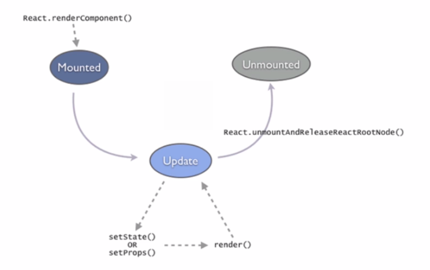

Title: React使用笔记-React Components的生命周期
Date: 2015-11-27 21:23
Category: Web
Tags: JavaScript
Author: 刘理想

[toc]

##1. React Components的生命周期

React Components的3种状态：



- Mounted:React Component被render解析，生成对应的DOM节点，并被插入浏览器的DOM结构的过程。这个过程结束了就是这个组件被`Mounted`了。
- Update:一个被mounted的React Component被重新render的过程。
- Unmounted:一个被mounted的React Component对应的DOM节点被从DOM结构中移除的这样一个过程。

每一个状态React都封装了对应的hook函数。

---

##2. React Components生命周期中的hook函数


###2.1 实验，来添加mount的hook函数

我们使用`getInitialState`, `componentWillMount`, `componentDidMount`来添加React Component在Mount阶段的hook函数，其中`getIntialState`返回一个键值对对象。

```jsx
<div id="container"></div>
<script type="text/jsx">
    var Hello = React.createClass({
        getInitialState: function(){
            alert("getInitialState");
            return {
                opacity: 1.0,
                fontSize: '20px'
            }
        },
        render: function(){
            return <div style={{color:'red'}}>Hello, {this.props.name}</div>;
        },
        componentWillMount: function(){
            alert("component will mount");
        },
        componentDidMount: function(){
            alert("component did");
        }
    });

    React.render(<Hello name="world"/>,
        document.getElementById("container"));
</script>
```

`getIntialState`返回的对象如何使用呢，使用`{this.state}`就可以了:

```jsx
render: function(){
    return <div style={this.state}>Hello, {this.props.name}</div>;
}
```

这里`state`中都是合法有效的键值，如果不是的话需要这样用：

```jsx
render: function(){
    return <div style={{opacity:this.state.opacity, fontSize: this.state.fontSize}}>Hello, {this.props.name}</div>;
}
```

`props`和`state`的区别是什么呢？`props`是属于调用者的，而`state`是属于当前组件的。

---

###2.2 如何修改state呢？

我们调用`setState`，比如我们在组件mount后一秒更改`state`，我们这样：

```jsx
componentDidMount: function(){
    var _self = this;
    window.setTimeout(function(){
        _self.setState({
            opacity: 0.5,
            fontSize: '44px'
        });
    }, 1000);
}
```

这里对`var _self = this`进行说明：

`this`指的是调用函数的那个对象，也就是函数的所有者，而`setTimeout`中的`function`并不属于任何对象，它只是一个纯粹的函数调用，所以属于全局对象，这种情况下，`this`是`global`，因此我们为了调用组件对象，需要使用`var _self = this`的这种方法。

既然说到了`this`，我们不妨多讲一些`this`的使用情况，比如：

我们把函数当做构造函数来使用，这种情况下，`this`就是指构造函数生成的对象：

```
function test(){
    this.x = 1;
}

var o = new test();
```

还有一种则是调用函数的`apply`, `call`, `bind`等方法，其作用是改变函数的调用对象，它们的第一个参数就是改变后的调用这个函数的对象，因此这种情况下，`this`指的就是第一个参数所代表的对象。因此，刚才的例子可以这样写，让`function`里面的`this`指向`function`外面的`this`。

```jsx
componentDidMount: function(){
    window.setTimeout(function(){
        this.setState({
            opacity: 0.5,
            fontSize: '44px'
        });
    }.bind(this), 1000);
}
```

注意，`bind`是从ES5才开始有的，早期的IE不支持。

通过现象看本质，我们发现，每次组件的`state`发生变化都会导致组件进入`update`阶段，从而重新render。注意，我们并没有显式的修改组件的样式，而是`state`的值变了之后，样式就跟着改变了。

---

###2.3 Update阶段

我们看开始的图，可以看到：

- `componentWillReceiveProps`:当一个`mounted`的组件将要接收新的`property`时，此函数会被调用，其函数参数就是新的`props`对象。我们可以在函数体内比较这个`props`参数和`this.props`，从而执行一些例如修改`state`这样的操作。
- `shouldComponentUpdate`: 在一个`mounted`的组件已经接收到新的`state`和`props`对象之后，判断是否有必要去更新DOM结构。这个函数的参数有2个，一个就是新的`props`对象，第二个参数是新的`state`对象。我们可以分别对比其跟`this.props`和`this.state`来决定是否需要更新DOM结构。返回`true`表示更新，返回`false`表示不更新。
- `componentWillUpdate`: 组件更新前调用。
- `compoentDidUpdate`: 组件更新后调用。

一般我们很少会更新上面的4个函数

---

###2.4 Unmounting阶段

当我们要把一个组件销毁掉的时候，则是`unmounting`阶段了，它只有一个调用函数：

`componentWillUnmount`:我们在这个函数内执行一些clean up的操作，比如释放内存、图片等。得益于浏览器的垃圾回收机制，我们基本不需要使用这个函数。

