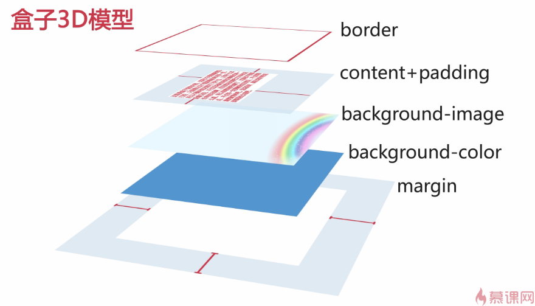

Title: 网页布局基础
Date: 2015-03-31 14:39
Category: Web
Tags: CSS, HTML
Author: 刘理想

##1. 自动居中一列布局

###1.1 相关知识讲解

####1.1.1 W3C标准：

结构化标准语言(HTML和XML)
表现标准语言(CSS)
行为标准语言(DOM和ECMAScript)

倡导结构、样式、行为分离

####1.1.2 CSS中的定位机制
CSS中，存在3种定位机制：
- 标准文档流(Normal Flow)
- 浮动(Floats)
- 绝对定位(Absolute Position)

####1.1.3 标准文档流

特点：
从上到下，从左到右，输出文档内容
由块级元素与行级元素组成

**块级元素**
从左到右，独占一行
触碰到页面边缘时，会自动换行。

常见块级元素：
	div ul li dl dt p

**行级元素**
能在同一行内显示，不会改变HTML的文档结构

常见行级元素：
	span strong img input ...

块级元素和行级元素都是盒子模型。

###1.2 盒子模型

>css中盒子模型包含属性margin、border、padding、width与height，他们可以把它转移到我们日常生活中的盒子（箱子）上来理解，日常生活中所见的盒子也具有这些属性，所以叫它盒子模式。那么内容就是盒子里装的东西（element）；而填充（padding）就是怕盒子里装的东西（贵重的）损坏而添加的泡沫或者其它抗震的辅料；边框（border）就是盒子本身了；至于边界（margin）则说明盒子摆放的时候的不能全部堆在一起，要留一定空隙保持通风，同时也为了方便取出嘛。

####1.2.1 盒子模型由4部分组成

- 边框(border)
- 外边框(margin)
- 内边距(padding)
- 盒子中的内容(content)

其中边框、外边框和内边框有4个方向，同时设置是顺时针方向设置（上、右、下、左）

设置4个值时就是上右下左
设置3个值：第一个值代表top，第二个代表right\left，第三个是bottom
设置2个值：第一个代表top\bottom, 第二个代表right\left
设置1个值：4个方向属性都是相同的。

就近原则：行内样式>内部样式>外部原则

###1.2.2 边框的设置

粗细、样式、颜色的顺序，3者缺一不可

```
img{
	margin:10px 18px;
	border: 1px solid #b1adad;
}
```

注意：图片之间的间距是用margin来设置的

####1.2.3 盒子3D模型

见下图



####1.2.4 背景设置

```
.book{
	background: url(images/t_book.gif) 0 0 no-repeat;
}
```

设置顺序：背景图 横坐标 纵坐标 重复 颜色; 其中横坐标、纵坐标、颜色可以省略。

从盒子3D模型可以知道，背景层在边框和内容与内间距的下层，为了避免内容遮盖住背景图片，应该给盒子添加内边距(padding)。

####1.2.4 盒子模型尺寸

盒子模型尺寸=边框+外边框+内边框+盒子中的内容尺寸

css中width与height的计算方法

在 CSS 中，width 和 height 指的是内容区域的宽度和高度。增加内边距、边框和外边距不会影响内容区域的尺寸，但是会增加元素框的尺寸。

但是在浏览器中实际的宽度与高度的值是按width=margin-left + margin-right + padding-left + padding-right + width与height=margin-left + margin-right + padding-left + padding-right + height这个计算的。所以当我们布局一个网页的时候，经常会遇到这样的一种情况，那就是最终网页成型的宽度或是高度会超出我们预先的计算，其实就就是所谓的CSS的盒模型造成的。因此在我们布局网页的时候要将这一部分内容计算在内。

例如：#div{margin:10px;padding:10px;border:10px;width:100px;height:100px;} 他的实际width为160px ，height为160px。


###1.3 网页布局基础-自动居中一列布局

将页面设置为

```
{margin: 0px auto; width: 960px;}
```

auto是让浏览器自动计算两边的外边距。width可以使像素，也可以是百分比。

**注意：设置自动居中的div不能再设置浮动(float)或绝对定位属性(position:absolute)**

---

##2. 横向两列布局

###2.1 浮动布局简洁及float属性

1. 浮动布局：CSS中规定的第三种定位机制，通过设置float属性实现横向多列。
2. float属性有4个属性值：
- left:左浮动
- right:右浮动
- none:不浮动
- inherit:从父元素继承float属性

特点：
1. 元素会左移，或右移，直到碰触到容器为止
2. 设置了浮动的元素，仍旧处于标准文档流中

当元素没有设置宽度值，而设置了浮动属性，元素的宽度随内容的变化而变化。

当元素设置浮动属性后，会对相邻的元素产生影响（相邻元素特指**紧邻后面**的元素）。

当两个元素都设置浮动时，其紧挨着的相邻元素就会被影响。

###2.2 清除浮动常用的两种方法

第一种方法：为元素设置`clear`属性，并设置为`clear:both;` 或`clear:left;` 或者`clear:right;`

第二种方法：为元素设置`width:100%`或固定宽度，然后`overflow:hidden;`

###2.3 横向两列布局

主要方法：

1. float属性，使纵向两列的块级元素，横向排列；
2. margin属性，设置两列之间的间距。

设置float的两列布局对其父包含块和父包含的紧邻元素产生影响，因此需对父包含和紧邻元素清除浮动：

- 对父包含块清除不能使用`clear:both;`，要使用`overflow:hidden;`;
- 紧邻元素使用`clear:both;`清除浮动。

**最好不要设置div的高度**。

增加两列之间的间距使用margin或者设置另一侧为right浮动。

---

##3. 绝对定位布局

###3.1 绝对定位布局简介

CSS中规定的第三种定位机制。能够实现横向多列布局及较为复杂的定位，例如：带有遮罩层效果的提示框、固定层效果、全屏广告等。

position有3种形式：1. 静态定位（默认的） 2. 相对的(relative) 3. 绝对定位(absolute, fixed)
position有4个属性值：static, relative, absolute, fixed(固定定位)

###3.2 相对定位

特点：

- 相对于自身原有位置进行便宜;
- 仍旧处于标准文档流中;
- 随即拥有偏移属性(top, right, bottom, left)和z-index属性。

设置相对定位后，可以设置偏移属性：`top:50px;left:100px;`.

###3.3 绝对定位

特点：

- 建立了以包含块为基准的定位
- 完全脱离了标准文档流
- 随即拥有了偏移属性和Z-index属性

####3.3.1 未设置偏移量

特点：

- 无论是否存在**已定位祖先元素**，都保持在元素出事位置；
- 脱离了标准文档流，宽度随内容而变

如果一个元素存在相对定位、绝对定位、固定定位中的任何一个，都叫已定位了

一般来说，设置了绝对定位的元素其父包含块需要设置相对定位。

####3.3.2 使用绝对定位实现横向两列布局

这种应用比较少。
一般应用于：一列固定宽度，另一列宽度自适应的情况

主要应用技能：
relative:父元素相对定位
absolute：自适应宽度元素绝对定位
margin:让绝对定位的元素给固定宽度的元素让出一些位置。

**注意：固定宽度列的高度要大于自适应列**