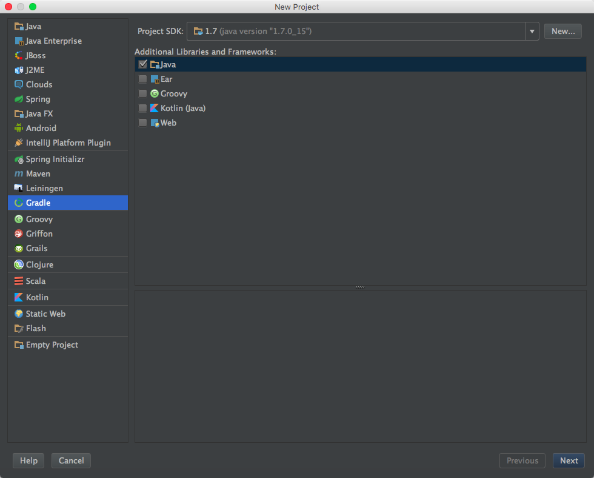
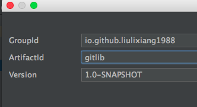
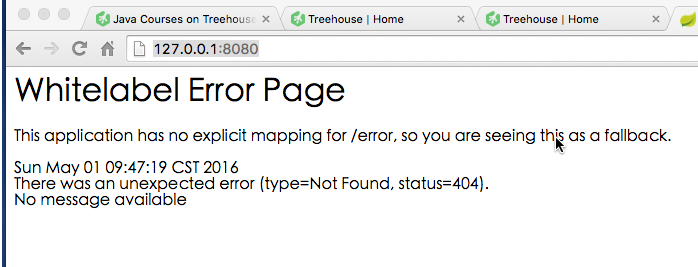

Title: Spring学习笔记
Date: 2016-04-30 15:43
Category: Java
Tags: Java, Spring
Author: 刘理想

[toc]

##1. 环境配置

###1.1 创建应用

打开idea,新建应用：



然后输入包名、应用名：



其他默认。

###1.2 修改build.gradle

打开build.gradle，修改dependencies:

```
group 'io.github.liulixiang1988'
version '1.0-SNAPSHOT'

buildscript {
    repositories {
        mavenCentral()
    }
    dependencies {
        classpath 'org.springframework.boot:spring-boot-gradle-plugin:1.3.3.RELEASE'
    }
}

apply plugin: 'java'
apply plugin: 'spring-boot'

sourceCompatibility = 1.5

repositories {
    mavenCentral()
}

dependencies {
    compile 'org.springframework.boot:spring-boot-starter-web:1.3.3.RELEASE'
}
```

注意，我们使用spring boot，它依赖于spring mvc的。并且，添加了`buildscript`和`apply plugin: 'spring-boot'`，用来运行spring应用。

然后在项目根目录下新建`src/main/java`文件夹。

现在通过IDEA的View->Tools View->Gradle打开Gradle面板，点击同步图标来下载安装依赖。

###1.3 添加spring配置文件

在`src/main/java`中新建包`io.github.liulixiang1988`。并在这个包里新建`AppConfig.java`。它用来启动应用。

```java
package io.github.liulixiang1988;

import org.springframework.boot.SpringApplication;
import org.springframework.boot.autoconfigure.EnableAutoConfiguration;

@EnableAutoConfiguration //自动配置
public class AppConfig {
    public static void main(String[] args){
        SpringApplication.run(Appconfig.class, args);
    }
}
```

此时，右键选择运行gradle面板下的Tasks/application/bootRun任务。

打开浏览器http://127.0.0.1:8080/ 可以看到页面：



这就说明你成功了。

##2. 创建控制器和视图

###2.1 创建控制器处理HTTP请求

首先在`io.github.liulixiang1988`下创建一个包`controller`。然后在这个包里创建`GifController`类。

```java
package io.github.liulixiang1988.controller;

import org.springframework.stereotype.Controller;
import org.springframework.web.bind.annotation.RequestMapping;
import org.springframework.web.bind.annotation.ResponseBody;

@Controller //1. 标识控制器
public class GifController {
    @RequestMapping("/") //2. 添加映射
    @ResponseBody //3. 返回响应
    public String listGifs() {
        return "List of all gifs";
    }
}
```

添加过Controller之后，应用并不能自己发现Controller，因此，我们修改`AppConfig.java`，添加`@ComponentScan`。

```java
@EnableAutoConfiguration //自动配置
@ComponentScan //扫描控制器
public class AppConfig {
    public static void main(String[] args){
        SpringApplication.run(AppConfig.class, args);
    }
}
```

现在重新运行bootRun任务，打开http://127.0.0.1:8080 可以看到如下响应。


###2.2 使用Thymeleaf渲染模板

我们使用Thymeleaf来渲染模板，因此，需要先修改`build.gradle`用来添加相应的库。

```
dependencies {
    compile 'org.springframework.boot:spring-boot-starter-thymeleaf'
}
```

然后在gradle面板中的刷新按钮安装对应的包。

Thymeleaf默认寻找src/main/resources/templates下的模板，因此，我们创建对应的文件夹。

在templates目录下面创建home.html。注意，Thymeleaf要求必须html标签必须有结束标签或者自关闭的。

```html
<!DOCTYPE html>
<html lang="en">
<head>
    <meta charset="UTF-8" />
    <title>Giflib | Home</title>
</head>
<body>
    <h1>首页</h1>
    <p>hello</p>
    
</body>
</html>
```

现在修改控制器GifController:

```java
@Controller //1. 标识控制器
public class GifController {
    @RequestMapping("/") //2. 添加映射
    public String listGifs() {
        return "home"; //3. 返回模板名称
    }
}
```

###2.3 添加静态文件

在`resources`目录下新建`static`目录用来存放静态文件。我们在`static`文件夹下分别创建`css`, `fonts`, `js`文件夹。直接把bootstrap添加进来。

修改`home.html`：

```html
<!DOCTYPE html>
<html lang="en"  xmlns:th="http://www.thymeleaf.org">
<head>
    <meta charset="UTF-8" />
    <title>Giflib | Home</title>
    <link rel="stylesheet" th:href="@{/css/bootstrap.min.css}"/>
    <link rel="stylesheet" th:href="@{/css/app.css}"/>
</head>
<body>
    <div class="container">
        <div class="row">
            <h1>首页</h1>
            <p>hello</p>
            
        </div>
    </div>
    <script th:src="@{/js/bootstrap.min.js}"></script>
</body>
</html>
```

需要说明的是：
- 添加`xmlns:th`
- 静态文件的链接是以`static`文件夹为根目录，使用`@{}`引入。

##3. 模型、数据存取

###3.1 数据注入到模板

首先，创建`model`模块，并在下面创建`Gif.java`:

```java
package io.github.liulixiang1988.model;

import java.time.LocalDate;

public class Gif {
    private String name;
    private LocalDate dateUploaded;
    private String username;
    private boolean favorite;

    public Gif(String name, LocalDate dateUploaded, String username, boolean favorite) {
        this.name = name;
        this.dateUploaded = dateUploaded;
        this.username = username;
        this.favorite = favorite;
    }

    public String getName() {
        return name;
    }

    public void setName(String name) {
        this.name = name;
    }

    public LocalDate getDateUploaded() {
        return dateUploaded;
    }

    public void setDateUploaded(LocalDate dateUploaded) {
        this.dateUploaded = dateUploaded;
    }

    public String getUsername() {
        return username;
    }

    public void setUsername(String username) {
        this.username = username;
    }

    public boolean isFavorite() {
        return favorite;
    }

    public void setFavorite(boolean favorite) {
        this.favorite = favorite;
    }
}
```

修改`GifController`，注入数据：

```java
@Controller //1. 标识控制器
public class GifController {
    @RequestMapping("/") //2. 添加映射
    public String listGifs() {
        return "home"; //3. 返回模板名称
    }

    @RequestMapping("/gif")
    public String getDetails(ModelMap modelMap) {
        Gif gif = new Gif("compiler-bot", LocalDate.of(2016, 5, 1), "刘理想", true);
        modelMap.put("gif", gif);
        return "gif-details";
    }
}
```

数据注入是使用`ModelMap`来实现的。

打开模板`gif-detail.html`，调用注入的数据方法是`${}`方法。

```
<div class="frame row">
    <div class="col s12">
        
        <a href="#" class="mark favorite"></a>
    </div>
</div>
```

###3.2 创建数据仓库组件

创建包`data`，并在其中创建`GifRepository`类。

```java
package io.github.liulixiang1988.data;

import java.time.LocalDate;
import java.util.Arrays;
import java.util.List;

import io.github.liulixiang1988.model.Gif;
import org.springframework.stereotype.Component;

@Component //声明组件,用于依赖注入
public class GitRepository {
    private static final List<Gif> ALL_GIFS = Arrays.asList(
            new Gif("android-explosion", LocalDate.of(2016, 5, 1), "刘理想", true),
            new Gif("ben-and-mike", LocalDate.of(2016, 4, 10), "刘理想", true),
            new Gif("book-dominos", LocalDate.of(2016, 4, 1), "刘理想", true),
            new Gif("complier-bot", LocalDate.of(2016, 4, 12), "刘理想", true),
            new Gif("cowboy-coder", LocalDate.of(2016, 4, 13), "刘理想", false),
            new Gif("infinite-andrew", LocalDate.of(2016, 4, 15), "刘理想", true)
    );

    public Gif findByName(String name) {
        for (Gif gif : ALL_GIFS) {
            if (gif.getName().equals(name)) {
                return gif;
            }
        }
        return null;
    }
}
```

注意，这里使用`@Component`声明了组件，为后期的依赖注入做好准备。

现在修改`GifController`，添加`GifRepository`字段。

```java
public class GifController {
    @Autowired //依赖注入
    private GifRepository gifRepository;
//...
    @RequestMapping("/gif")
    public String getDetails(ModelMap modelMap) {
        Gif gif = gifRepository.findByName("ben-and-mike");
        modelMap.put("gif", gif);
        return "gif-details";
    }
}
```

###3.3 使用`@PathVariable`创建动态页

```java
@RequestMapping("/gif/{name}")
public String getDetails(@PathVariable String name, ModelMap modelMap) {
    Gif gif = gifRepository.findByName(name);
    modelMap.put("gif", gif);
    return "gif-details";
}
```

然后修改对应的模板：

```
<div class="col s12">
    
    <a href="#" th:class="(${gif.favorite} ? 'un' : '') +'mark favorite'"></a>
</div>
```

###3.4 列表展示

列表数据注入：

```java
@RequestMapping("/") //2. 添加映射
public String listGifs(ModelMap modelMap) {
    List<Gif> allGifs = gifRepository.getAllGifs();
    modelMap.put("gifs", allGifs);
    return "home"; //3. 返回模板名称
}
```

模板展示：

```
<div th:each="gif : ${gifs}" class="col s12 l4">
    <a th:href="@{'/gif/'+${gif.name}}">
        
        <a href="#" th:class="@{(${gif.favorite} ? 'un': '')+'mark favorite'}"></a>
    </a>
</div>
```

##4. MVC架构

###4.1 添加Category类

```java
package io.github.liulixiang1988.model;

public class Category {
    private int id;
    private String name;

    public Category(int id, String name) {
        this.id = id;
        this.name = name;
    }

    public int getId() {
        return id;
    }

    public void setId(int id) {
        this.id = id;
    }

    public String getName() {
        return name;
    }

    public void setName(String name) {
        this.name = name;
    }
}
```

###4.2 添加CategoryRepository类

```java
package io.github.liulixiang1988.data;


import io.github.liulixiang1988.model.Category;
import org.springframework.stereotype.Component;

import java.util.Arrays;
import java.util.List;

@Component
public class CategoryRepository {
    private static final List<Category> ALL_CATEGORIES = Arrays.asList(
            new Category(1, "Technology"),
            new Category(2, "People"),
            new Category(3, "Destruction")
    );

    public List<Category> getAllCategories() {
        return ALL_CATEGORIES;
    }

    public Category findById(int id) {
        for (Category category :
                ALL_CATEGORIES) {
            if (category.getId() == id){
                return category;
            }
        }
        return null;
    }
}

```

###4.3 添加CateogryController

```java
package io.github.liulixiang1988.controller;

import io.github.liulixiang1988.data.CategoryRepository;
import io.github.liulixiang1988.data.GifRepository;
import io.github.liulixiang1988.model.Category;
import io.github.liulixiang1988.model.Gif;
import org.springframework.beans.factory.annotation.Autowired;
import org.springframework.stereotype.Controller;
import org.springframework.ui.ModelMap;
import org.springframework.web.bind.annotation.PathVariable;
import org.springframework.web.bind.annotation.RequestMapping;

import java.util.List;

@Controller
public class CategoryController {
    @Autowired
    private CategoryRepository categoryRepository;

    @Autowired
    private GifRepository gifRepository;

    @RequestMapping("/categories")
    public String listCategories(ModelMap modelMap){
        List<Category> categories = categoryRepository.getAllCategories();
        modelMap.put("categories", categories);
        return "categories";
    }

    @RequestMapping("/category/{id}")
    public String category(@PathVariable int id, ModelMap modelMap){
        Category category = categoryRepository.findById(id);
        modelMap.put("category", category);
        List<Gif> gifs = gifRepository.findByCategoryId(id);
        modelMap.put("gifs", gifs);
        return "category";
    }
}
```

###4.4 修改模板

```
<div class="search-bar container">
    <div class="row">
        <div class="col s12">
            <form action="#" method="get">
                <div class="input-field">
                    <input name="q" type="search" placeholder="Search all gifs..." required="required" autocomplete="off"/>
                    <i class="material-icons">search</i>
                </div>
            </form>
        </div>
    </div>
</div>
<div class="categories container">
    <div class="row">
        <!--
            Repeat the div element for each object in the 'categories'
            collection of the model map. Each object in the loop
            should be named 'category'
        -->
        <div th:each="category: ${categories}" class="col s12 l4">
            <div class="card">
                <div class="card-content">
                    <div class="card-title">
                        <!--
                            Set the href attribute of the a tag to be the URI to
                            a specific category according to the category's id.
                            For example, /category/1 or /category/2

                            Then, set the text between the a tags to be the category name,
                            coming from the 'name' field of the 'category' object
                            in the model map
                        -->
                        <a th:href="@{'/category/'+${category.id}}" th:text="${category.name}">Category Name</a>
                    </div>
                </div>
            </div>
        </div>
    </div>
</div>
```

```
<div class="gifs container">
    <!--
        In the div element, replace the 'category name' text
        with the value of the 'name' field of the 'category'
        object from the model map
    -->
    <div class="chip" th:text="${category.name}">category name</div>
    <div class="row">
        <!--
            Repeat the div element for each object in the 'gifs'
            collection of the model map. Each object in the loop
            should be named 'gif'
        -->
        <div th:each="gif : ${gifs}" class="col s12 l4">
            <!--
                    In the a tag, make the href attribute point to
                    the GIF detail page using the 'name' field of
                    the 'gif' object from the loop above
             -->
            <a th:href="@{'/gif/'+ ${gif.name}}">
                <!--
                    In the img tag, make the src attribute point
                    to the static GIF image, according to the 'name'
                    field of the 'gif' object from the loop above
                -->
                
                <!--
                    In the a tag, make the class attribute have the value
                    of 'mark favorite' or 'unmark favorite' according to
                    the 'favorite' field of the 'gif' object from the
                    loop above
                -->
                <a href="#" th:class="(${gif.favorite} ? 'un' : '') +'mark favorite'"></a>
            </a>
        </div>
    </div>
</div>
```
