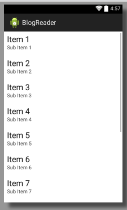
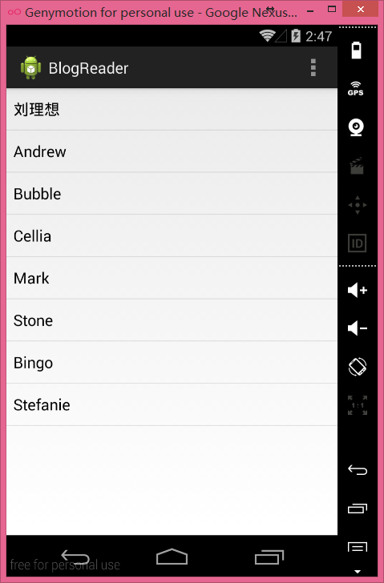

Title: 使用Android开发一个博客阅读器-02 从头开始创建
Date: 2014-09-24 16:16
Category: Android
Tags: Android学习笔记, Android, Androi博客阅读
Author: 刘理想
Summary: Android实战开发，使用Android开发一个博客阅读器，第二篇，从头创建

##1创建项目和ListActivity

###1.1 创建项目

创建Android项目，项目名称BlogReader，视图名称为MainListActivity。

###1.2 更改Activity

打开MainListActivity.java文件，修改继承为`ListActivity`，如下

```java
public class MainListActivity extends ListActivity
```

此时，会提示有错，主要是因为没有导入ListActivity这个类。在eclipse中，有一个快捷键可以快速修正这个错误：`ctrl+shift+o`。这个快捷键不仅会导入没有使用到的快捷键，还会去除没有使用的import。

###1.3 更改activity_main_list.xml

1. 删除生成的TextView

2. 添加`ListView`，如下所示：

```xml
<ListView
    android:id="@+id/listView1"
    android:layout_width="match_parent"
    android:layout_height="match_parent"
    android:layout_alignParentLeft="true"
    android:layout_alignParentTop="true" >
</ListView>
```

3. 更改`ListView`的ID

如果我们给`ListView`分配了一个特殊的ID，Android会自动为`ListActivity`调用这个`ListView`，修改上面的`ListView`如下：

```xml
<ListView
    android:id="@android:id/list"
    android:layout_width="match_parent"
    android:layout_height="match_parent"
    android:layout_alignParentLeft="true"
    android:layout_alignParentTop="true" >
</ListView>
```

4. 删除`RelativeLayout`自动生成的padding，整个layout文件如下：

```xml
<RelativeLayout xmlns:android="http://schemas.android.com/apk/res/android"
    xmlns:tools="http://schemas.android.com/tools"
    android:layout_width="match_parent"
    android:layout_height="match_parent"
    tools:context="liulx.blogreader.MainListActivity" >

    <ListView
        android:id="@android:id/list"
        android:layout_width="match_parent"
        android:layout_height="match_parent"
        android:layout_alignParentLeft="true"
        android:layout_alignParentTop="true" >
    </ListView>

</RelativeLayout>
```

预览图：



---

##2 处理没有数据的情况

当博客列表中没有数据时，我们最好给用户一个提醒，让用户知道是没有数据，而不是在加载数据。`ListActivity`提供了一个简单的方法来完成这件事。我们添加一个`TextView`，它能同`ListActivity`协同工作来完成这个工作，不过需要给它添加一个特殊的`id`，用来在list为空时显示。

```xml
<TextView 
    android:id="@android:id/empty"
    android:layout_width="match_parent"
    android:layout_height="wrap_content"
    android:layout_alignParentLeft="true"
    android:layout_alignParentTop="true"
    android:text="@string/no_data"/>
```

当list中包含数据时，`TextView`就会自动隐藏。

此时，因为没有数据，程序运行后是这个样子：


---

##3 向List中添加数据

###3.1 添加数组数据

打开MainListActivity.java，添加数组变量：

```java
protected String[] names = {
		"刘理想",
		"Andrew",
		"Bubble",
		"Cellia",
		"Mark",
		"Stone",
		"Bingo",
		"Stefanie"
		};
```

###3.2 添加`ArrayAdapter`

在`onCreate`中添加如下两行：

```java
ArrayAdapter<String> adapter = new ArrayAdapter<String>(this, android.R.layout.simple_list_item_1, names);
setListAdapter(adapter);
```
其中`ArrayAdapter(Context context, int resource, T[] objects)`的变量分别如下：

- context上下文
- 对应列表项的layout，使用系统自带的`android.R.layout.simple_list_item_1`
- objects是数据源，我们使用了`names`这个数组

运行后效果图



---

##4. 关于@String资源

###4.1 在java文件中引用res/values/strings.xml中定义的字符串

使用`Context`类的`getString`方法：

```java
getString(R.string.hello)
```

###4.2 添加字符串数组

打开res/values/strings.xml文件，添加字符串数组如下：

```xml
<string-array name="names">
    <item>刘理想</item>
	<item>Andrew</item>
	<item>Bubble</item>
	<item>Cellia</item>
	<item>Mark</item>
	<item>Stone</item>
	<item>Bingo</item>
	<item>Stefanie</item>
</string-array>
```

更改java 文件中的数组声明：

```java
protected String[] names ;
```

###4.3 调用字符串数组

通过以下方法

```java
Resources resource = getResources();
names = resource.getStringArray(R.array.names);
```

其中`getResources`获得资源，`resource.getStringArrary`获得数组。