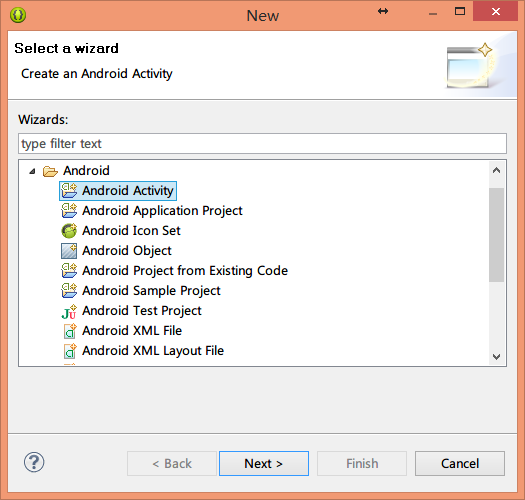
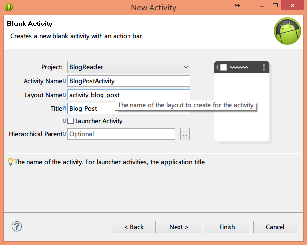
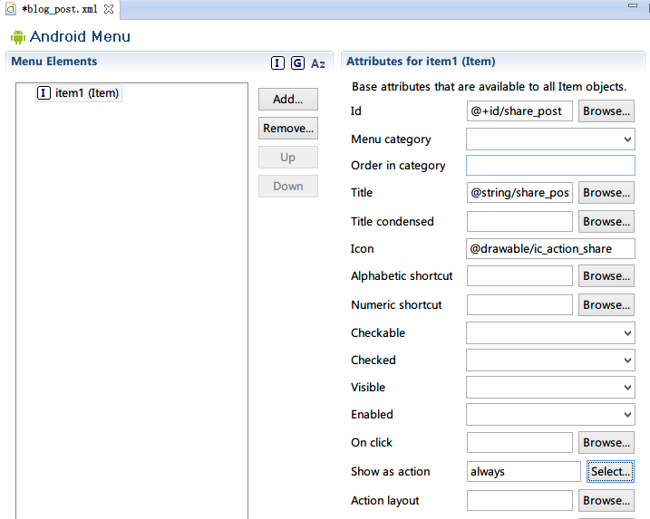

Title: 使用Android开发一个博客阅读器-05 使用Intent显示和共享博客
Date: 2014-10-10 13:30
Category: Android
Tags: Android学习笔记, Android, Androi博客阅读
Author: 刘理想
Summary: Android实战开发，使用Android开发一个博客阅读器，第五篇，使用Intent显示和共享博客

##1 在浏览器中打开网页

###1.1 `ListView`添加单击事件响应

要是`ListView`响应单击事件，重载函数：

```java
@Override
protected void onListItemClick(ListView l, View v, int position, long id) {    	
	super.onListItemClick(l, v, position, id);
}
```

参数：
- l：发生点击事件的ListView
- v: ListView中被点击的视图
- position：被点击的视图在list中的位置
- id：被点击视图的行ID

###1.2 获取URL

```java
@Override
protected void onListItemClick(ListView l, View v, int position, long id) {    	
	super.onListItemClick(l, v, position, id);
	JSONArray blogPosts;
	try {
		blogPosts = blogData.getJSONArray("posts");
    	JSONObject blogPost = blogPosts.getJSONObject(position);
    	String blogUrl = blogPost.getString("url");
	} catch (JSONException e) {
		Log.e(TAG, "Exception Caught", e);
	}
}
```

###1.3 使用Intent在浏览器中打开URL

```java
@Override
protected void onListItemClick(ListView l, View v, int position, long id) {    	
	super.onListItemClick(l, v, position, id);
	JSONArray blogPosts;
	try {
		blogPosts = blogData.getJSONArray("posts");
    	JSONObject blogPost = blogPosts.getJSONObject(position);
    	String blogUrl = blogPost.getString("url");
    	//设置Intent
    	Intent i = new Intent(Intent.ACTION_VIEW);
    	i.setData(Uri.parse(blogUrl));
    	startActivity(i);
	} catch (JSONException e) {
		Log.e(TAG, "Exception Caught", e);
	}
}
```

使用`Intent.setData`来设置`Uri`，Uri则是通过`Uri.parse(String)`来创建。

##2 在应用中打开网页

###2.1 创建一个包含`WebView`的Activity





对应的layout

```xml
<RelativeLayout xmlns:android="http://schemas.android.com/apk/res/android"
    xmlns:tools="http://schemas.android.com/tools"
    android:layout_width="match_parent"
    android:layout_height="match_parent"
    tools:context="liulx.blogreader.BlogPostActivity" >

    <WebView
        android:id="@+id/webView1"
        android:layout_width="match_parent"
        android:layout_height="match_parent"/>

</RelativeLayout>
```

###2.2 使用Inent调用

在MainListActivity中，修改`Intent`：

```java
Intent i = new Intent(this, BlogPostActivity.class);
```

其他不变。这种创建方法是显示创建。

###2.3 在包含`WebView`的Activity中打开网页

```java
@Override
protected void onCreate(Bundle savedInstanceState) {
	super.onCreate(savedInstanceState);
	setContentView(R.layout.activity_blog_post);
	
	Intent i = getIntent();
	Uri uri = i.getData();
	
	WebView webView = (WebView) findViewById(R.id.webView1);
	webView.loadUrl(uri.toString());
}
```

打开网页用的是`webView.loadUrl()`方法

##3 使用Intent进行简单的共享

###3.1 下载ActionBar图标


###3.2 创建ActionBar Item

打开menu/blog_post.xml，删除原来的item，然后添加新的item。



打开xml文件，使用eclipse的`ctrl+shift+f`，格式化代码如下：

```xml
<menu xmlns:android="http://schemas.android.com/apk/res/android">
    <item
        android:id="@+id/share_post"
        android:icon="@drawable/ic_action_share"
        android:showAsAction="always"
        android:title="@string/share_post">
    </item>
</menu>
```

###3.3 添加菜单项点击响应

重写

```java
public boolean onOptionsItemSelected(MenuItem item) {
	// Handle action bar item clicks here. The action bar will
	// automatically handle clicks on the Home/Up button, so long
	// as you specify a parent activity in AndroidManifest.xml.
	int id = item.getItemId();
	if (id == R.id.share_post) {
		
	}
	return super.onOptionsItemSelected(item);
}
```

###3.4 创建共享Intent

```java
@Override
public boolean onOptionsItemSelected(MenuItem item) {
	// Handle action bar item clicks here. The action bar will
	// automatically handle clicks on the Home/Up button, so long
	// as you specify a parent activity in AndroidManifest.xml.
	int id = item.getItemId();
	if (id == R.id.share_post) {
		sharePost();
	}
	return super.onOptionsItemSelected(item);
}

private void sharePost() {
	Intent shareIntent = new Intent(Intent.ACTION_SEND);
	shareIntent.setType("text/plain");
	shareIntent.putExtra(Intent.EXTRA_TEXT, url);
	startActivity(Intent.createChooser(shareIntent, getString(R.string.share_post)));
}
```

其中，
- `Intent.ACTION_SEND` - 用来设置发送Intent
- `shareIntent.putExtra(Intent.EXTRA_TEXT, url);`与`ACTION_SEND`配合使用
- `Intent.createChooser(shareIntent, getString(R.string.share_post))`选择Intent菜单

##4 总结

本节主要学习了如何使用Intent在浏览器、应用中打开网址，以及如何使用简单的共享。

至此，该应用完结，你创建了一个完整的应用。