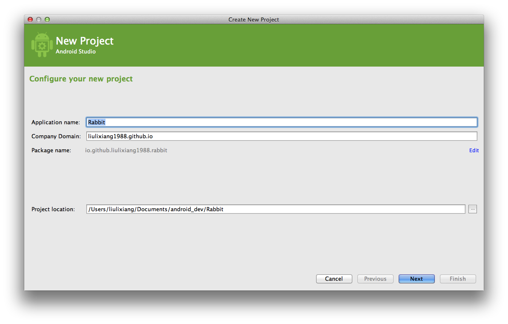
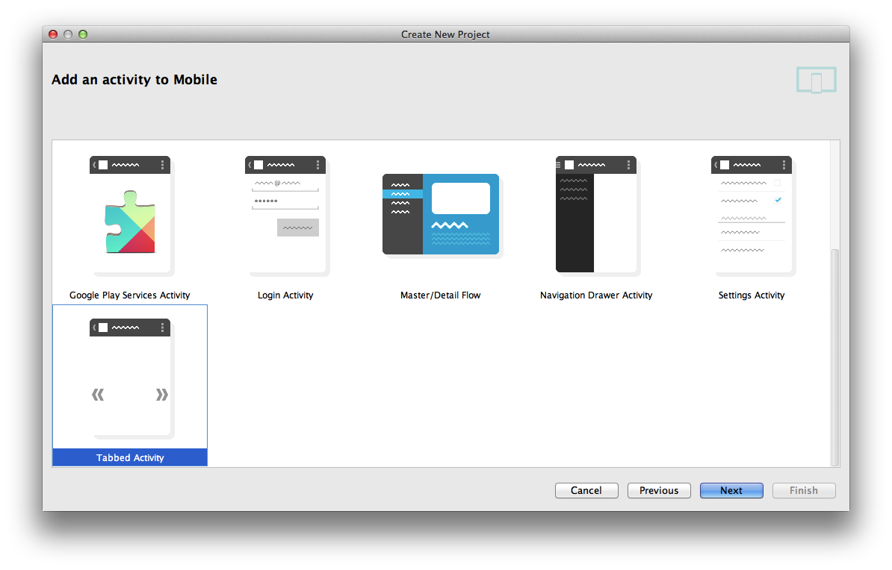
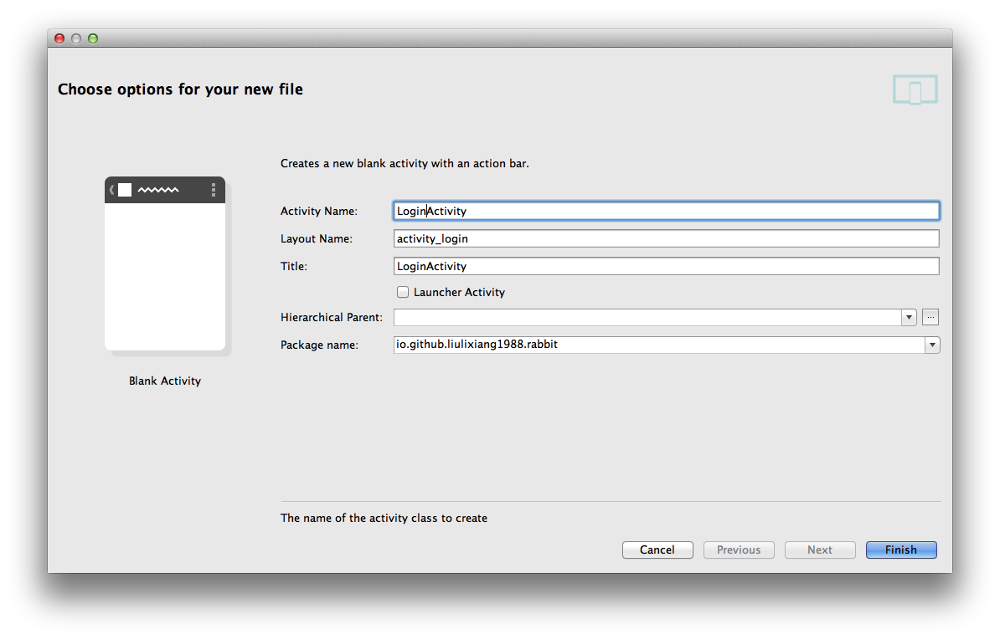
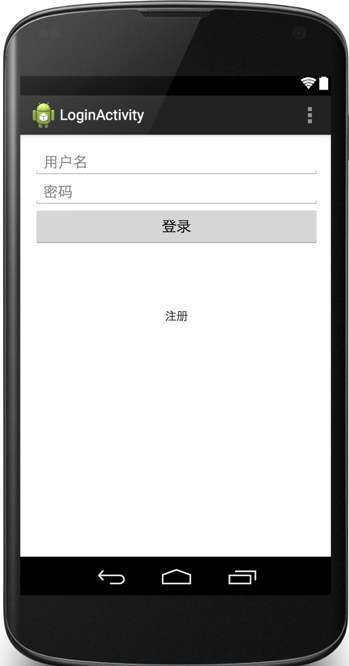
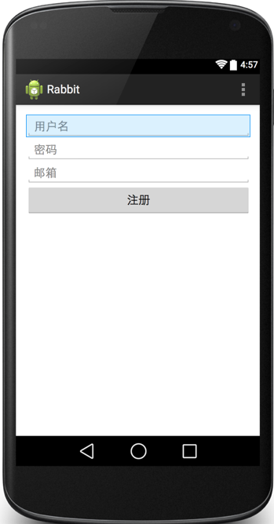
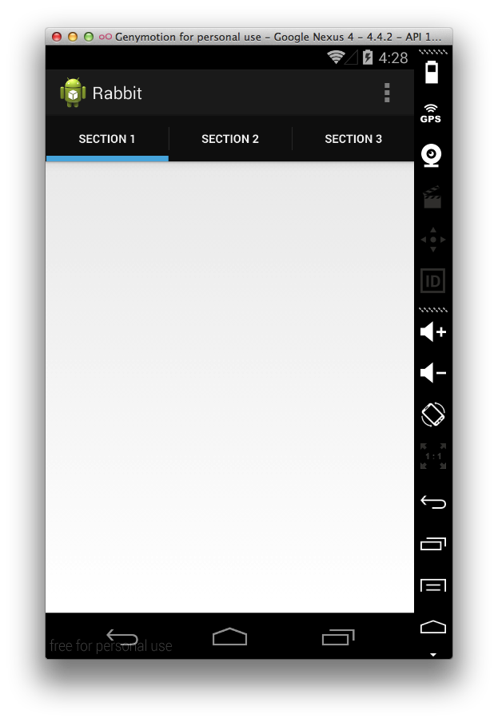

Title: 使用Android开发阅后即焚应用-01 开始
Date: 2014-10-04 09:48
Category: Android
Tags: Android学习笔记, Android, Androi阅后即焚
Author: 刘理想
Summary: 使用Android开发阅后即焚应用，项目介绍以及项目的搭建。

##1.阅后即焚应用介绍

阅后即焚是一款应用，用户可以适用它分享文字、照片给他的朋友，朋友们看过发来的消息之后该消息会自动销毁。

阅后即焚包含用户登录、用户注册、收件箱、好友列表、好友编辑、拍照等功能。

---

##2.开始项目

本次项目适用Android Stuidio进行开发。

打开Android Studio，选择"New Project"，然后输入信息如下：



选择最小SDK，我们选定4.0版本为最小SDK：


选择"Tabbed Activity"标签页作为基础Activity：



最后，设置项目的MainActivity、Title和Navigation Style。注意，Navigation Style选择"Action Bar Tabs(with ViewPager)"：


现在，我们设置好了项目，但是还有一件事情要做，我们只希望应用是垂直的，而不希望手机放平时，应用也跟着水平。我们需要编辑AndroidManifest.xml文件。双击AndroidManifest.xml，文件打开，我们在`activity`中添加属性`android:screenOrientation="portrait"`。与eclipse不同，Android Studio目前还没有图形化编辑AndroidManifest.xml的界面。

---

##3. 添加用户登录Activity

我们可以到http://www.mobile-patterns.com/ 查看一些优秀的设计，看看别人时怎么做登录设计的。

要添加登录页面，在菜单中选择"File"->"New..."->"Activity"->"Blank Activity"(注意，还有一个"Login Activity"，但在这里我们不选用它，而是从头创建)。弹出对话框中输入：



设置用户界面为垂直的，方法同设置MainActivity相同，添加`android:screenOrientation="portrait"`

构建用户登录界面如下：



对应的xml如下

```xml
<RelativeLayout xmlns:android="http://schemas.android.com/apk/res/android"
    xmlns:tools="http://schemas.android.com/tools"
    android:layout_width="match_parent"
    android:layout_height="match_parent"
    android:paddingLeft="@dimen/activity_horizontal_margin"
    android:paddingRight="@dimen/activity_horizontal_margin"
    android:paddingTop="@dimen/activity_vertical_margin"
    android:paddingBottom="@dimen/activity_vertical_margin"
    tools:context="io.github.liulixiang1988.rabbit.LoginActivity">

    <EditText
        android:layout_width="match_parent"
        android:layout_height="wrap_content"
        android:id="@+id/username"
        android:layout_alignParentTop="true"
        android:layout_alignParentLeft="true"
        android:layout_alignParentStart="true"
        android:hint="@string/username" />

    <EditText
        android:layout_width="match_parent"
        android:layout_height="wrap_content"
        android:inputType="textPassword"
        android:ems="10"
        android:id="@+id/password"
        android:layout_below="@+id/username"
        android:layout_alignParentLeft="true"
        android:layout_alignParentStart="true"
        android:hint="@string/password" />

    <Button
        android:layout_width="match_parent"
        android:layout_height="wrap_content"
        android:text="@string/login_btn_label"
        android:id="@+id/btnLogin"
        android:layout_below="@+id/password"
        android:layout_centerHorizontal="true" />

    <TextView
        android:layout_width="wrap_content"
        android:layout_height="wrap_content"
        android:textAppearance="?android:attr/textAppearanceSmall"
        android:text="@string/signup_text_label"
        android:id="@+id/txtSignUp"
        android:layout_marginTop="78dp"
        android:layout_below="@+id/btnLogin"
        android:layout_centerHorizontal="true" />
</RelativeLayout>
```

现在，我们想运行一下看看效果，但是启动界面时`MainActivity`，因此，我们在`MainActivity`的`onCreate`方法中添加：

```java
@Override
protected void onCreate(Bundle savedInstanceState) {
    super.onCreate(savedInstanceState);
    setContentView(R.layout.activity_main);
	
	//用户登录界面
    Intent intent = new Intent(this, LoginActivity.class);
    startActivity(intent);
    ...
}
```

---

##4. 添加用户注册Activity

新建Activity，添加的Activity名称为`SignupActivity`。

设置界面垂直。

设置Layout如下：



对应的xml如下：

```xml
<RelativeLayout xmlns:android="http://schemas.android.com/apk/res/android"
    xmlns:tools="http://schemas.android.com/tools"
    android:layout_width="match_parent"
    android:layout_height="match_parent"
    android:paddingLeft="@dimen/activity_horizontal_margin"
    android:paddingRight="@dimen/activity_horizontal_margin"
    android:paddingTop="@dimen/activity_vertical_margin"
    android:paddingBottom="@dimen/activity_vertical_margin"
    tools:context="io.github.liulixiang1988.rabbit.SignupActivity">

    <EditText
        android:layout_width="match_parent"
        android:layout_height="wrap_content"
        android:id="@+id/usernameField"
        android:layout_alignParentTop="true"
        android:layout_alignParentLeft="true"
        android:layout_alignParentStart="true"
        android:hint="@string/username" />

    <EditText
        android:layout_width="match_parent"
        android:layout_height="wrap_content"
        android:inputType="textPassword"
        android:ems="10"
        android:id="@+id/passwordField"
        android:layout_below="@+id/usernameField"
        android:layout_alignParentLeft="true"
        android:layout_alignParentStart="true"
        android:hint="@string/password" />

    <EditText
        android:layout_width="match_parent"
        android:layout_height="wrap_content"
        android:inputType="textEmailAddress"
        android:ems="10"
        android:id="@+id/emailField"
        android:layout_below="@+id/passwordField"
        android:layout_alignParentLeft="true"
        android:layout_alignParentStart="true"
        android:hint="@string/email_text_label" />

    <Button
        android:layout_width="match_parent"
        android:layout_height="wrap_content"
        android:text="@string/signup_btn_label"
        android:id="@+id/btnSignup"
        android:layout_below="@+id/emailField"
        android:layout_alignParentLeft="true"
        android:layout_alignParentStart="true" />
</RelativeLayout>
```

添加从登录LoginActivity到注册SignupActivity的跳转。打开LoginActivity，添加如下：

```java
protected TextView txtSignup;

@Override
protected void onCreate(Bundle savedInstanceState) {
    super.onCreate(savedInstanceState);
    setContentView(R.layout.activity_login);

    txtSignup = (TextView) findViewById(R.id.txtSignUp);
    txtSignup.setOnClickListener(new View.OnClickListener() {
        @Override
        public void onClick(View view) {
            Intent i = new Intent(LoginActivity.this, SignupActivity.class);
            startActivity(i);
        }
    });
}
```

---

##5. Back和Up导航

Up导航是在app内导航到上一级别，**始终是在同一个app内**, 而Back导航则是根据用户的历史记录进行导航，比如导航到桌面或者其他应用中。

现在我们想要设置Signup(注册)的Up导航是Login(登录)，该怎么办呢？

打开AndroidManifest.xml，在Signup中添加`android:parentActivityName`，如下：

```xml
<activity
    android:name=".SignupActivity"
    android:label="@string/title_activity_signup"
    android:parentActivityName=".LoginActivity">
</activity>
```

**注意**，`android:parentActivityName`的值设置为Activity类名，也可以设置全名，比如`io.github.liulixiang1988.rabbit.LoginActivity`

现在，我们再次运行程序，点击"注册"后，界面切换到注册，如下：


请注意图中用红色线框住的那一部分，有一个返回图标，点击它就会返回到登录界面。

另一个问题，如果我们在登录界面按鼠标上的返回按钮，那会发生什么呢？我们点击一下看看，竟然是收件箱画面：



这肯定不对，因为用户没有登录，不应该看到这个画面。

这种是由于什么原因导致的呢？Android在Activity跳转的过程中，会自己维护一个堆栈用来存放Activity的顺序，该堆栈适用后进先出的方式，在按返回按钮时会逐层返回Activity。有时我们想开辟一个新的堆栈，这个时候就需要添加一些flag来告诉Android我们的想法。对于Rabbit应用，我们希望用户在登录界面点击返回按钮时不要回到收件箱。这个时候，我们需要在MainActivity中设置flag。

```java
Intent intent = new Intent(this, LoginActivity.class);
//第1种方法
//intent.setFlags(Intent.FLAG_ACTIVITY_NEW_TASK|Intent.FLAG_ACTIVITY_CLEAR_TASK);
//第2种方法
intent.addFlags(Intent.FLAG_ACTIVITY_NEW_TASK);
intent.addFlags(Intent.FLAG_ACTIVITY_CLEAR_TASK);
startActivity(intent);
```

这样，当在登录界面时按返回按钮就不会有到收件箱这种现象了。

